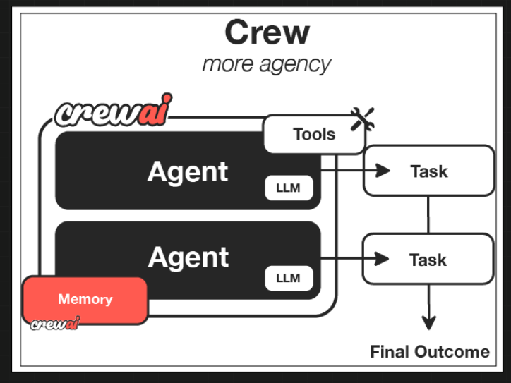
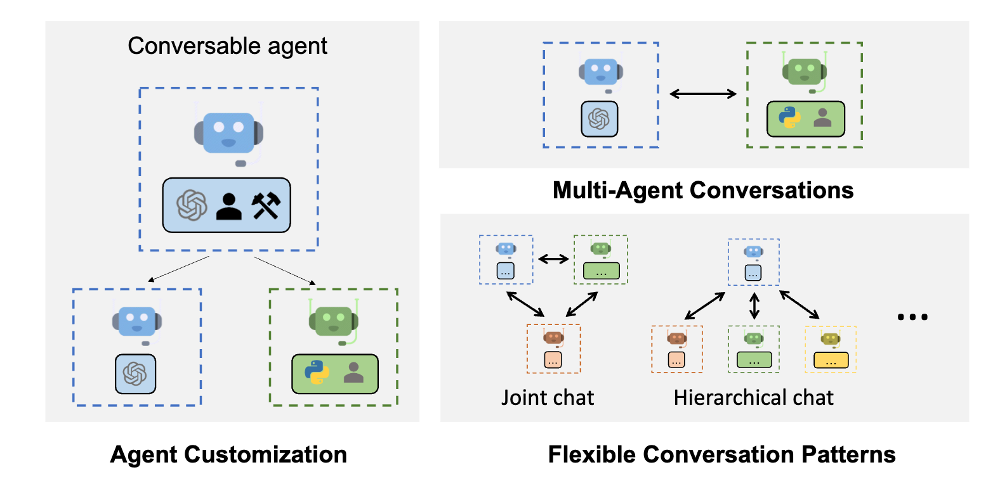

# AI Agent Frameworks: Building Your Dream Team of AI Agents

*Image placeholder: Visualization showing multiple AI agents working together in a system*
## Introduction

In today's rapidly evolving AI landscape, building effective teams of AI agents has become a critical skill for developers looking to create sophisticated, collaborative AI systems. The choice of framework is pivotal - it can mean the difference between a streamlined development process and months of unnecessary technical challenges.

This guide provides an overview of the leading AI agent frameworks, highlighting their key features to help you make an informed decision for your next AI project. For each framework, we've created detailed dedicated guides and executable notebooks so you can dive deeper into the ones that interest you most.

## Framework Comparison At-A-Glance

| Framework | Architecture | Best For | Learning Curve | State Management |
|-----------|-------------|----------|---------------|-----------------|
| LangChain | Chain-based | Sequential workflows, RAG systems | Moderate | Basic |
| CrewAI | Role-based | Human-like team structures | Straightforward | Task-based |
| AutoGen | Conversation-based | Agent-to-agent dialogue | Moderate to steep | Conversation-based |
| LangGraph | Graph-based | Complex workflow branching | Steep | Advanced with persistence |

## LangChain: The Pioneer

LangChain has emerged as one of the most widely-adopted frameworks for building language model applications, gaining popularity for its modular and flexible architecture.

*LangChain's chain-based architecture for building AI applications*

### Key Features
- **Chain-based architecture** for sequential processing steps
- **Modular components** that can be easily swapped and reconfigured
- **Extensive integrations** with databases, APIs, and services
- **Strong community support** with active development

**Ideal For**: Simple chatbots, RAG pipelines, sequential workflows

**Limitations**: Gets messy with complex multi-agent collaborations

[**Read Detailed LangChain Guide**](/Agents/LangChain_Detailed_Guide.md) | [**Try LangChain Notebook**](/Notebooks/LangChain_Examples.ipynb)

## CrewAI: The Role-Based Collaborator

CrewAI takes a fundamentally different approach, focusing on creating human-like team structures with well-defined roles and responsibilities.

*CrewAI's key features for agent team collaboration*

### Key Features

- **Role-based system** with explicit agent roles and goals
- **Human-like team structures** with clear responsibilities
- **Task delegation** based on agent capabilities
- **Built-in collaboration models** for agent interaction

**Ideal For**: Projects requiring human-like team structures and role-based tasks

**Limitations**: Memory management issues in complex scenarios

[**Read Detailed CrewAI Guide**](/Agents/CrewAI_Detailed_Guide.md) | [**Try CrewAI Notebook**](https://colab.research.google.com/github/Shubham-vish/prepwithai_tutorials/blob/main/Agents/Notebooks/CrewAI_Examples.ipynb)

## AutoGen: Microsoft's Conversational Approach

Developed by Microsoft, AutoGen takes a unique conversation-centric approach to multi-agent systems.

*Microsoft's AutoGen framework for conversational AI agents*

### Key Features

- **Conversation-based architecture** where agents communicate with each other
- **Multi-agent conversations** as the primary workflow mechanism
- **Human-in-the-loop capabilities** for interactive scenarios
- **Code execution environments** built into the framework

**Ideal For**: Systems where agents need to collaborate through conversation

**Limitations**: Complex setup, resource intensive

[**Read Detailed AutoGen Guide**](/Agents/AutoGen_Detailed_Guide.md) | [**Try AutoGen Notebook**](https://colab.research.google.com/github/Shubham-vish/prepwithai_tutorials/blob/main/Agents/Notebooks/AutoGen_Examples.ipynb)

## LangGraph: The Advanced Orchestrator

LangGraph builds on LangChain's foundation, offering more sophisticated control flow for complex agent systems.

*LangGraph's advanced orchestration capabilities for complex AI workflows*

### Key Features

- **Graph-based architecture** for complex directed workflows
- **Advanced state management** with persistence options
- **Non-linear execution paths** with sophisticated branching
- **Visualization tools** for debugging complex workflows

**Ideal For**: Complex workflows with multiple branches and conditions

**Limitations**: Steep learning curve, requires LangChain knowledge

[**Read Detailed LangGraph Guide**](/Agents/LangGraph_Detailed_Guide.md) | [**Try LangGraph Notebook**](https://colab.research.google.com/github/Shubham-vish/prepwithai_tutorials/blob/main/Agents/Notebooks/LangGraph_Examples.ipynb)

## Building Custom Solutions

While each framework offers distinct advantages, many production-level systems ultimately require custom solutions that combine elements from multiple frameworks or implement proprietary approaches.

[**Read About Custom Solutions**](/Agents/Custom_Solutions_Guide.md) | [**Try Hybrid Framework Notebook**](https://colab.research.google.com/github/Shubham-vish/prepwithai_tutorials/blob/main/Agents/Notebooks/Hybrid_Framework_Examples.ipynb)

## Conclusion

There is no "one-size-fits-all" framework for AI agent teams. The optimal choice depends on your specific use case, development resources, and system requirements.

As the field of AI agent systems continues to evolve rapidly, staying flexible and willing to adapt your approach based on emerging best practices will be key to success. Rather than committing exclusively to one framework, consider developing expertise across multiple options to select the right tool for each specific challenge.

---

*Want to discuss which framework might be right for your project? Have questions about implementing any of these solutions? Reach out in the comments with "agents" for a personalized response!*