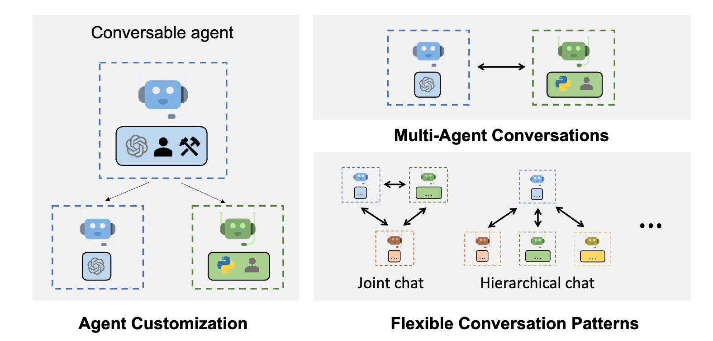
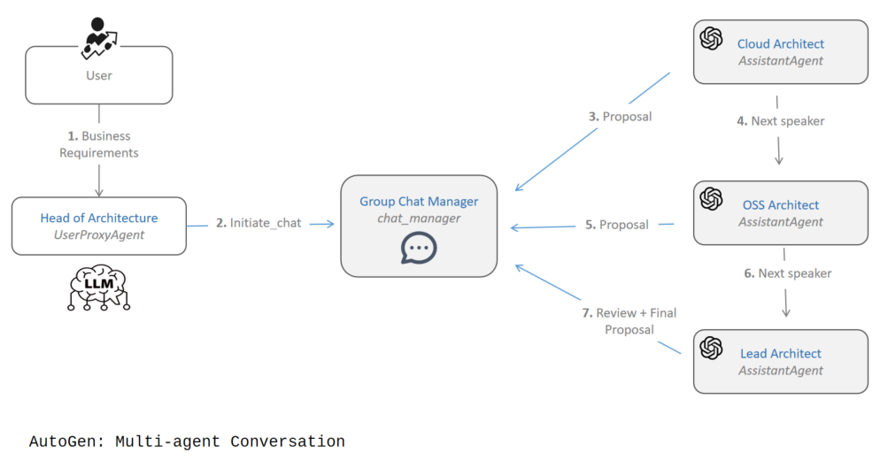

# AutoGen: Microsoft's Conversational AI Agent Framework


*Microsoft's AutoGen framework for conversational AI agents*

## Helpful Resources

- [Official AutoGen Documentation](https://microsoft.github.io/autogen/)
- [AutoGen GitHub Repository](https://github.com/microsoft/autogen)
- [AutoGen Examples Gallery](https://microsoft.github.io/autogen/docs/Examples)
- [AutoGen Discord Community](https://discord.gg/pAbnFJrkgZ)
- [AutoGen API Reference](https://microsoft.github.io/autogen/docs/reference/)
- [AutoGen Research Paper](https://arxiv.org/abs/2308.08155)
- [Microsoft Blog: Introducing AutoGen](https://www.microsoft.com/en-us/research/blog/autogen-enabling-next-generation-large-language-model-applications/)

For hands-on examples and executable code, check out our [AutoGen Examples Notebook](https://colab.research.google.com/github/Shubham-vish/prepwithai_tutorials/blob/main/Agents/Notebooks/AutoGen_Examples.ipynb).

## What is AutoGen?

AutoGen is an open-source framework developed by Microsoft Research that enables building applications using multiple conversational agents that can work together to solve tasks. Released in 2023, it has gained significant traction due to its innovative approach to multi-agent collaboration through natural conversation.

Unlike other frameworks that focus on sequential chains or role-based teams, AutoGen centers around the concept of agent-to-agent conversations as the primary mechanism for task completion.

## Core Architecture: Conversation-Based Collaboration

The fundamental concept behind AutoGen is enabling natural dialogue between specialized agents. AutoGen's architecture is designed to facilitate multi-agent conversations where agents:

1. Exchange messages to solve problems collaboratively
2. Reason through complex tasks step by step
3. Generate, execute, and debug code
4. Incorporate human feedback when needed


*Diagram showing how agents communicate in AutoGen*

### Key Components

1. **Agent Types**: Various specialized agent types with different capabilities
2. **Conversational Memory**: Context management for multi-turn interactions
3. **Human-in-the-loop Integration**: Ability to incorporate human feedback
4. **Code Execution**: Built-in capability to generate and run code
5. **Message Routing**: Advanced mechanisms for directing agent conversations

## Why Choose AutoGen?

### Strengths

1. **Natural Dialogue-Based Problem Solving**: AutoGen agents interact through conversations that are similar to how human experts would collaborate, making the problem-solving process more intuitive.

2. **Powerful Conversational Reasoning**: The framework excels at breaking down complex problems through multi-step reasoning in conversation format.

3. **First-Class Code Generation and Execution**: AutoGen has robust support for generating, executing, and debugging code within agent conversations.

4. **Flexible Agent Configuration**: AutoGen allows for sophisticated customization of agent behaviors, personalities, and expertise.

5. **Native Group Chat Support**: The framework is specifically designed for multi-agent conversations, not just sequential processing.

### Real-World Applications

AutoGen is particularly well-suited for:

- **Software Development**: Collaborative coding, testing, and debugging
- **Data Analysis**: Multi-step data processing and visualization
- **Complex Problem Solving**: Breaking down difficult problems requiring multiple perspectives
- **Research Assistance**: Agents that can explore ideas and perform experiments
- **Interactive Tools**: Applications where human feedback needs to be incorporated naturally

## Detailed Code Examples

### Basic Two-Agent Conversation

```python
from autogen import AssistantAgent, UserProxyAgent, config_list_from_json

# Configure the LLM
config_list = [
    {
        'model': 'gpt-4',
        'api_key': 'your-api-key-here'
    }
]

# Create an assistant agent
assistant = AssistantAgent(
    name="AI_Assistant",
    llm_config={"config_list": config_list},
    system_message="You are a helpful AI assistant. Respond concisely."
)

# Create a user proxy agent
user_proxy = UserProxyAgent(
    name="User_Proxy",
    human_input_mode="NEVER",  # Don't ask for human input in this example
    max_consecutive_auto_reply=10,
    code_execution_config={"work_dir": "coding", "use_docker": False},
    system_message="You are a proxy for the user. Help test the assistant."
)

# Start the conversation
user_proxy.initiate_chat(
    assistant,
    message="Can you write a simple Python function to calculate the Fibonacci sequence?"
)
```

### Multi-Agent Group Chat

```python
from autogen import AssistantAgent, UserProxyAgent, GroupChat, GroupChatManager, config_list_from_json

# Configure the LLM
config_list = [
    {
        'model': 'gpt-4',
        'api_key': 'your-api-key-here'
    }
]

# Create specialized assistant agents
coder = AssistantAgent(
    name="Coder",
    llm_config={"config_list": config_list},
    system_message="You are a Python expert. You write efficient, well-documented code. Focus on implementing functionality correctly."
)

reviewer = AssistantAgent(
    name="Code_Reviewer",
    llm_config={"config_list": config_list},
    system_message="You are a code reviewer who focuses on code quality, security, and best practices. Suggest improvements when necessary."
)

tester = AssistantAgent(
    name="Tester",
    llm_config={"config_list": config_list},
    system_message="You are a QA specialist who writes tests to verify code functionality. Focus on edge cases and comprehensive test coverage."
)

product_manager = AssistantAgent(
    name="Product_Manager",
    llm_config={"config_list": config_list},
    system_message="You are a product manager who ensures that the implementation meets requirements and is user-friendly. Consider the end-user experience."
)

# Create a user proxy agent
user_proxy = UserProxyAgent(
    name="User",
    human_input_mode="TERMINATE",  # Only ask for human input when termination is requested
    code_execution_config={"work_dir": "coding", "use_docker": False},
    system_message="You represent the user in this conversation."
)

# Create a group chat with all agents
groupchat = GroupChat(
    agents=[user_proxy, coder, reviewer, tester, product_manager],
    messages=[],
    max_round=20
)

# Create a manager for the group chat
manager = GroupChatManager(groupchat=groupchat)

# Start the conversation
user_proxy.initiate_chat(
    manager,
    message="We need to build a simple web scraper that extracts product information from an e-commerce website, storing the data in a CSV file."
)
```

### Agent with Code Execution

```python
from autogen import AssistantAgent, UserProxyAgent

# Create an agent with coding capabilities
assistant = AssistantAgent(
    name="Coding_Assistant",
    llm_config={
        "temperature": 0,
        "config_list": [{"model": "gpt-4", "api_key": "your-api-key-here"}]
    },
    system_message="You are a Python expert who writes and executes code to solve problems."
)

# Create a user proxy agent with code execution capabilities
user_proxy = UserProxyAgent(
    name="User",
    human_input_mode="TERMINATE",
    code_execution_config={
        "work_dir": "coding_workspace",
        "use_docker": False  # Set to True to run code in Docker
    }
)

# Start the conversation with a coding task
user_proxy.initiate_chat(
    assistant,
    message="Create a Python script that generates a fractal tree and saves it as an image."
)
```

### Custom Agent with Tool Use

```python
from autogen import AssistantAgent, UserProxyAgent
import os
import json
import requests

# Define a custom tool/function that agents can use
def get_weather(location):
    """Get the current weather for a location"""
    api_key = "your-weather-api-key"  # Replace with an actual API key
    url = f"https://api.example.com/weather?location={location}&key={api_key}"
    
    try:
        # This is a mock implementation
        # response = requests.get(url)
        # data = response.json()
        
        # Mock data for demonstration
        data = {
            "location": location,
            "temperature": "72°F",
            "conditions": "Sunny",
            "humidity": "45%"
        }
        
        return json.dumps(data)
    except Exception as e:
        return f"Error retrieving weather: {str(e)}"

# Register the function as a callable tool
def register_function(func):
    def wrapper(agent, message):
        # Extract function name and arguments from the message
        try:
            if f"{func.__name__}(" in message:
                start_idx = message.find(f"{func.__name__}(") + len(f"{func.__name__}(")
                end_idx = message.find(")", start_idx)
                args_str = message[start_idx:end_idx].strip("'\"")
                result = func(args_str)
                return f"Function result: {result}"
        except Exception as e:
            return f"Error calling function: {str(e)}"
        return None
    
    return wrapper

# Create the assistant agent
assistant = AssistantAgent(
    name="Weather_Assistant",
    llm_config={
        "temperature": 0.2,
        "config_list": [{"model": "gpt-4", "api_key": "your-api-key-here"}]
    },
    system_message="You are a helpful assistant that can check the weather. To check the weather, use the get_weather(location) function with the city name."
)

# Create a user proxy agent with the registered function
user_proxy = UserProxyAgent(
    name="User",
    human_input_mode="TERMINATE",
    function_map={"get_weather": get_weather}
)

# Start the conversation
user_proxy.initiate_chat(
    assistant,
    message="What's the weather like in New York today?"
)
```

## Limitations and Challenges

While AutoGen offers powerful capabilities for agent conversations, it has some notable limitations:

1. **Setup Complexity**: AutoGen can be more complex to set up than some other frameworks, particularly for complex multi-agent systems.

2. **Resource Intensity**: The conversation-based approach can use more tokens and computational resources than more streamlined frameworks.

3. **Learning Curve**: The framework has a steeper learning curve, especially for advanced features like custom agent creation.

4. **Real-time Performance**: AutoGen is not optimized for applications requiring real-time responses.

5. **Documentation Gaps**: While improving, the documentation may not cover all use cases thoroughly.

## When to Use AutoGen

AutoGen is an excellent choice when:

- Your application benefits from natural conversation between agents
- You need sophisticated reasoning through dialogue
- Code generation and execution are core requirements
- You want human-in-the-loop capabilities
- Complex problem-solving requires multiple specialized perspectives

It may not be the best choice when:

- You need simple, linear workflows
- Resource efficiency is a primary concern
- You require high-performance, real-time systems
- Your application has simple state management needs
- You're looking for the most straightforward implementation approach

## Getting Started with AutoGen

### Installation

```bash
pip install pyautogen
```

For all features, including advanced human feedback:

```bash
pip install "pyautogen[all]"
```

### Resources

- [Official Documentation](https://microsoft.github.io/autogen/)
- [GitHub Repository](https://github.com/microsoft/autogen)
- [Examples Gallery](https://microsoft.github.io/autogen/docs/Examples)
- [Discord Community](https://discord.gg/pAbnFJrkgZ)

## Conclusion

AutoGen represents a significant innovation in the AI agent framework landscape with its focus on conversational collaboration between agents. Its approach mimics how human experts work together to solve problems, making it particularly effective for complex reasoning tasks.

While it requires more setup effort than some frameworks, AutoGen's powerful conversational capabilities, code execution features, and flexible agent configuration options make it an excellent choice for sophisticated multi-agent applications. The framework continues to evolve rapidly, with Microsoft actively developing new features and improvements.

For hands-on examples and executable code, check out our [AutoGen Examples Notebook](https://colab.research.google.com/github/Shubham-vish/prepwithai_tutorials/blob/main/Agents/Notebooks/AutoGen_Examples.ipynb).