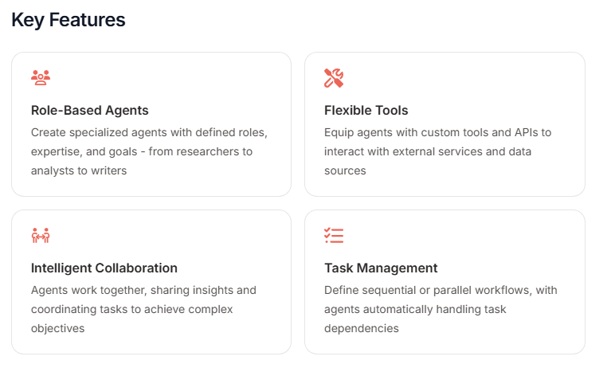
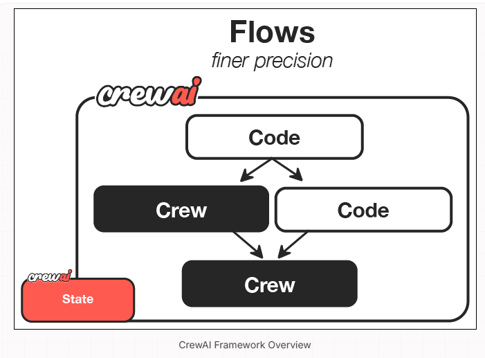
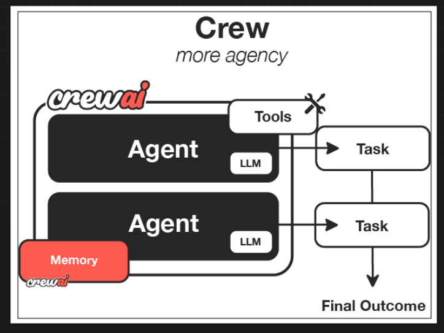
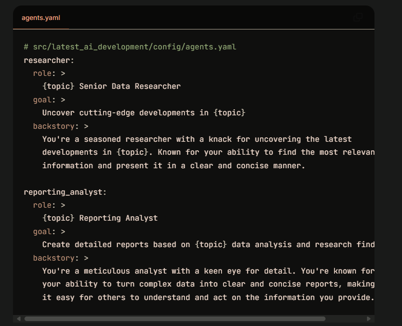
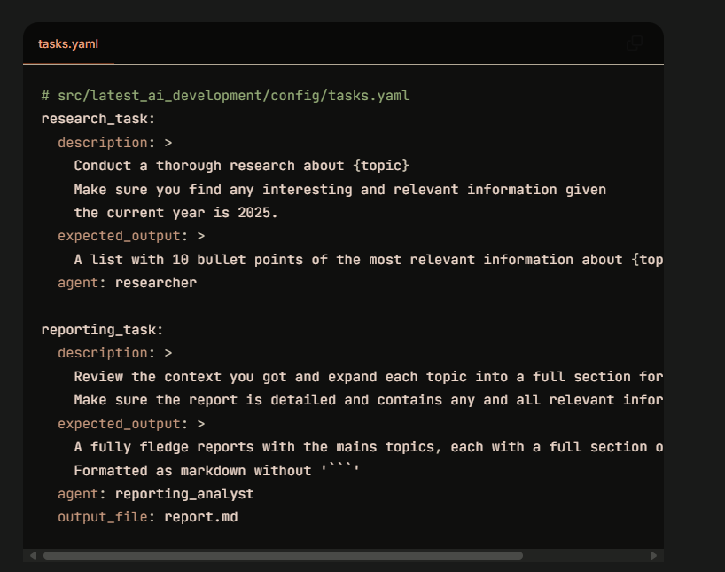

# CrewAI: Building Human-like AI Agent Teams


*CrewAI's key features for agent team collaboration*

## Helpful Resources

- [Official CrewAI Documentation](https://docs.crewai.com/)
- [CrewAI GitHub Repository](https://github.com/joaomdmoura/crewAI)
- [CrewAI Examples Repository](https://github.com/joaomdmoura/crewAI-examples)
- [CrewAI Community Discord](https://discord.gg/X4JWnZnX)
- [CrewAI Blog](https://www.crewai.io/blog)


For hands-on examples and executable code, check out our [CrewAI Examples Notebook](https://colab.research.google.com/github/Shubham-vish/prepwithai_tutorials/blob/main/Agents/Notebooks/CrewAI_Examples.ipynb).

## What is CrewAI?

CrewAI is a lean, lightning-fast Python framework built entirely from scratch—completely independent of LangChain or other agent frameworks. Created by Joao Moura, it enables developers to build systems where multiple agents collaborate in human-like teams to solve complex tasks.

CrewAI empowers developers with both high-level simplicity and precise low-level control through two main components:

1. **CrewAI Crews**: Optimize for autonomy and collaborative intelligence, enabling you to create AI teams where each agent has specific roles, tools, and goals.

2. **CrewAI Flows**: Enable granular, event-driven control, single LLM calls for precise task orchestration and support Crews natively.

Unlike frameworks that focus on sequential processes or conversational exchanges, CrewAI emphasizes roles, responsibilities, and task delegation among specialized agents.

## Core Architecture: Role-Based Teamwork

CrewAI's architecture centers around the concept of human team structures, with explicit roles and assigned tasks. This approach is inspired by organizational psychology and team dynamics.


*CrewAI's framework overview showing how teams of AI agents work together*

### Key Components

| Component | Description | Key Features |
|-----------|-------------|--------------|
| **Crew** | The top-level organization | • Manages AI agent teams<br>• Oversees workflows<br>• Ensures collaboration<br>• Delivers outcomes |
| **AI Agents** | Specialized team members | • Have specific roles (researcher, writer)<br>• Use designated tools<br>• Can delegate tasks<br>• Make autonomous decisions |
| **Process** | Workflow management system | • Defines collaboration patterns<br>• Controls task assignments<br>• Manages interactions<br>• Ensures efficient execution |
| **Tasks** | Individual assignments | • Have clear objectives<br>• Use specific tools<br>• Feed into larger process<br>• Produce actionable results |


*CrewAI's interface for defining agent teams*


*Example of how agents are defined in CrewAI with roles and backstories*


### Example: Defining Agents:
```yaml
# src/latest_ai_development/config/agents.yaml
researcher:
  role: >
    {topic} Senior Data Researcher
  goal: >
    Uncover cutting-edge developments in {topic}
  backstory: >
    You're a seasoned researcher with a knack for uncovering the latest
    developments in {topic}. Known for your ability to find the most relevant
    information and present it in a clear and concise manner.

reporting_analyst:
  role: >
    {topic} Reporting Analyst
  goal: >
    Create detailed reports based on {topic} data analysis and research findings
  backstory: >
    You're a meticulous analyst with a keen eye for detail. You're known for
    your ability to turn complex data into clear and concise reports, making
    it easy for others to understand and act on the information you provide.
```

### Example: Defining a Crew
```yaml
research_task:
  description: >
    Conduct a thorough research about {topic}
    Make sure you find any interesting and relevant information given
    the current year is 2025.
  expected_output: >
    A list with 10 bullet points of the most relevant information about {topic}
  agent: researcher

reporting_task:
  description: >
    Review the context you got and expand each topic into a full section for a report.
    Make sure the report is detailed and contains any and all relevant information.
  expected_output: >
    A fully fledge reports with the mains topics, each with a full section of information.
    Formatted as markdown without '```'
  agent: reporting_analyst
  output_file: report.md
```

### How It All Works Together

1. The Crew organizes the overall operation
2. AI Agents work on their specialized tasks
3. The Process ensures smooth collaboration
4. Tasks get completed to achieve the goal

## Why Choose CrewAI?

### Key Features

1. **Role-Based Agents**: Create specialized agents with defined roles, expertise, and goals - from researchers to analysts to writers.

2. **Flexible Tools**: Equip agents with custom tools and APIs to interact with external services and data sources.

3. **Intelligent Collaboration**: Agents work together, sharing insights and coordinating tasks to achieve complex objectives.

4. **Task Management**: Define sequential or parallel workflows, with agents automatically handling task dependencies.

5. **Backstory-Driven Behavior**: Agents can be given rich backstories that inform their approach to tasks, leading to more specialized behaviors.

6. **Low Setup Overhead**: Compared to some other frameworks, CrewAI has a relatively straightforward learning curve.


### Why Choose CrewAI?

- 🧠 **Autonomous Operation**: Agents make intelligent decisions based on their roles and available tools
- 📝 **Natural Interaction**: Agents communicate and collaborate like human team members
- 🛠️ **Extensible Design**: Easy to add new tools, roles, and capabilities
- 🚀 **Production Ready**: Built for reliability and scalability in real-world applications
- 🔒 **Security-Focused**: Designed with enterprise security requirements in mind
- 💰 **Cost-Efficient**: Optimized to minimize token usage and API calls

### Real-World Applications

CrewAI is particularly well-suited for:

- **Content Creation Pipelines**: Using specialized agents for research, writing, editing, etc.
- **Business Process Automation**: Creating teams of agents that handle different aspects of a business workflow
- **Research Assistant Systems**: Delegating different research tasks to specialized agents
- **Educational Tools**: Creating teams of teaching agents with different areas of expertise
- **Product Development**: Using agents specialized in different aspects of product creation

## CrewAI Flows: Fine-Grained Control

While Crews excel at autonomous collaboration, Flows provide structured automations, offering granular control over workflow execution. Flows ensure tasks are executed reliably, securely, and efficiently, handling conditional logic, loops, and dynamic state management with precision. Flows integrate seamlessly with Crews, enabling you to balance high autonomy with exacting control.

| Component | Description | Key Features |
|-----------|-------------|--------------|
| **Flow** | Structured workflow orchestration | • Manages execution paths<br>• Handles state transitions<br>• Controls task sequencing<br>• Ensures reliable execution |
| **Events** | Triggers for workflow actions | • Initiate specific processes<br>• Enable dynamic responses<br>• Support conditional branching<br>• Allow for real-time adaptation |
| **States** | Workflow execution contexts | • Maintain execution data<br>• Enable persistence<br>• Support resumability<br>• Ensure execution integrity |
| **Crew Support** | Enhances workflow automation | • Injects pockets of agency when needed<br>• Complements structured workflows<br>• Balances automation with intelligence<br>• Enables adaptive decision-making |

### When to Use Crews vs. Flows

Understanding when to use Crews versus Flows is key to maximizing the potential of CrewAI in your applications.

| Use Case | Recommended Approach | Why? |
|----------|---------------------|------|
| Open-ended research | Crews | When tasks require creative thinking, exploration, and adaptation |
| Content generation | Crews | For collaborative creation of articles, reports, or marketing materials |
| Decision workflows | Flows | When you need predictable, auditable decision paths with precise control |
| API orchestration | Flows | For reliable integration with multiple external services in a specific sequence |
| Hybrid applications | Combined approach | Use Flows to orchestrate overall process with Crews handling complex subtasks |

## Detailed Code Examples

### Basic Crew Example (with OpenAI)

```python
from crewai import Agent, Task, Crew
from langchain_openai import ChatOpenAI

# Set up the OpenAI language model
openai_llm = ChatOpenAI(
    model="gpt-4",
    temperature=0.7,
    api_key="your-openai-api-key"  # Replace with your actual API key
)

# Create specialized agents
researcher = Agent(
    role="Research Analyst",
    goal="Find comprehensive information on AI frameworks",
    backstory="You are an expert researcher with 15 years of experience in AI technology analysis. You're known for your thorough and unbiased technical evaluations.",
    llm=openai_llm
)

writer = Agent(
    role="Technical Writer",
    goal="Create clear, engaging content about technical subjects",
    backstory="You are a skilled technical writer who can explain complex concepts in accessible language. You have a talent for creating compelling narratives around technical topics.",
    llm=openai_llm
)

# Define tasks for each agent
research_task = Task(
    description="Research the top 3 AI agent frameworks. Compare their architectures, strengths, and limitations.",
    agent=researcher
)

writing_task = Task(
    description="Using the research provided, create a comprehensive guide to AI agent frameworks. The content should be informative, engaging, and accessible to developers with basic AI knowledge.",
    agent=writer
)

# Form a crew with these agents and tasks
crew = Crew(
    agents=[researcher, writer],
    tasks=[research_task, writing_task]
)

# Execute the crew's workflow
result = crew.kickoff()
print(result)
```


*Example of task definition in CrewAI framework*

### Basic Crew Example (with Azure OpenAI)

```python
from crewai import Agent, Task, Crew
from langchain_openai import AzureChatOpenAI

# Set up the Azure OpenAI language model
azure_llm = AzureChatOpenAI(
    azure_deployment="gpt-4",
    openai_api_version="2023-05-15",
    azure_endpoint="https://your-azure-resource-name.openai.azure.com/",
    api_key="your-azure-openai-api-key",  # Replace with your actual Azure OpenAI API key
    temperature=0.7
)

# Create specialized agents
researcher = Agent(
    role="Research Analyst",
    goal="Find comprehensive information on AI frameworks",
    backstory="You are an expert researcher with 15 years of experience in AI technology analysis. You're known for your thorough and unbiased technical evaluations.",
    llm=azure_llm
)

writer = Agent(
    role="Technical Writer",
    goal="Create clear, engaging content about technical subjects",
    backstory="You are a skilled technical writer who can explain complex concepts in accessible language. You have a talent for creating compelling narratives around technical topics.",
    llm=azure_llm
)

# Define tasks for each agent
research_task = Task(
    description="Research the top 3 AI agent frameworks. Compare their architectures, strengths, and limitations.",
    agent=researcher
)

writing_task = Task(
    description="Using the research provided, create a comprehensive guide to AI agent frameworks. The content should be informative, engaging, and accessible to developers with basic AI knowledge.",
    agent=writer
)

# Form a crew with these agents and tasks
crew = Crew(
    agents=[researcher, writer],
    tasks=[research_task, writing_task]
)

# Execute the crew's workflow
result = crew.kickoff()
print(result)
```

### Agent with Tools Example (OpenAI)

```python
from crewai import Agent, Task, Crew
from crewai.tools import SerperDevTool, WebsiteSearchTool
from langchain_openai import ChatOpenAI

# Set up the OpenAI language model
openai_llm = ChatOpenAI(
    model="gpt-4",
    temperature=0.7,
    api_key="your-openai-api-key"  # Replace with your actual API key
)

# Initialize tools
search_tool = SerperDevTool(api_key="your-serper-api-key")  # Replace with your Serper API key
web_tool = WebsiteSearchTool()

# Create an agent with tools
researcher = Agent(
    role="Research Analyst",
    goal="Find the latest information on AI technologies",
    backstory="You're a technology researcher who specializes in staying current with AI advancements.",
    tools=[search_tool, web_tool],
    verbose=True,
    llm=openai_llm
)

# Create a writing agent
writer = Agent(
    role="Content Creator",
    goal="Create engaging blog content",
    backstory="You transform complex information into reader-friendly content.",
    llm=openai_llm
)

# Define tasks
research_task = Task(
    description="Research the latest advancements in LLMs. Focus on breakthrough capabilities and limitations.",
    agent=researcher
)

writing_task = Task(
    description="Create a blog post about LLM advancements based on the research. Make it engaging and informative.",
    agent=writer,
    context=[research_task]  # This task depends on the research task
)

# Form a crew
crew = Crew(
    agents=[researcher, writer],
    tasks=[research_task, writing_task],
    verbose=2  # Increased verbosity to see the process
)

# Execute the workflow
result = crew.kickoff()
print(result)
```

### Agent with Tools Example (Azure OpenAI)

```python
from crewai import Agent, Task, Crew
from crewai.tools import SerperDevTool, WebsiteSearchTool
from langchain_openai import AzureChatOpenAI

# Set up the Azure OpenAI language model
azure_llm = AzureChatOpenAI(
    azure_deployment="gpt-4",
    openai_api_version="2023-05-15",
    azure_endpoint="https://your-azure-resource-name.openai.azure.com/",
    api_key="your-azure-openai-api-key",  # Replace with your actual Azure OpenAI API key
    temperature=0.7
)

# Initialize tools
search_tool = SerperDevTool(api_key="your-serper-api-key")  # Replace with your Serper API key
web_tool = WebsiteSearchTool()

# Create an agent with tools
researcher = Agent(
    role="Research Analyst",
    goal="Find the latest information on AI technologies",
    backstory="You're a technology researcher who specializes in staying current with AI advancements.",
    tools=[search_tool, web_tool],
    verbose=True,
    llm=azure_llm
)

# Create a writing agent
writer = Agent(
    role="Content Creator",
    goal="Create engaging blog content",
    backstory="You transform complex information into reader-friendly content.",
    llm=azure_llm
)

# Define tasks
research_task = Task(
    description="Research the latest advancements in LLMs. Focus on breakthrough capabilities and limitations.",
    agent=researcher
)

writing_task = Task(
    description="Create a blog post about LLM advancements based on the research. Make it engaging and informative.",
    agent=writer,
    context=[research_task]  # This task depends on the research task
)

# Form a crew
crew = Crew(
    agents=[researcher, writer],
    tasks=[research_task, writing_task],
    verbose=2  # Increased verbosity to see the process
)

# Execute the workflow
result = crew.kickoff()
print(result)
```

### Complex Multi-Agent Interaction (OpenAI)

```python
from crewai import Agent, Task, Crew, Process
from langchain_openai import ChatOpenAI

# Set up the language model
openai_llm = ChatOpenAI(
    model="gpt-4",
    temperature=0.7,
    api_key="your-openai-api-key"  # Replace with your actual API key
)

# Create multiple specialized agents
researcher = Agent(
    role="Research Analyst",
    goal="Find comprehensive information",
    backstory="You are an expert researcher who excels at finding accurate information.",
    llm=openai_llm
)

writer = Agent(
    role="Writer",
    goal="Create engaging content",
    backstory="You are a talented writer who can explain complex topics clearly.",
    llm=openai_llm
)

editor = Agent(
    role="Editor",
    goal="Ensure content quality and accuracy",
    backstory="You have a keen eye for detail and high standards for quality.",
    llm=openai_llm
)

seo_specialist = Agent(
    role="SEO Specialist",
    goal="Optimize content for search engines",
    backstory="You understand how to make content rank well in search results.",
    llm=openai_llm
)

# Create tasks with dependencies
research_task = Task(
    description="Research AI frameworks comprehensively",
    agent=researcher
)

writing_task = Task(
    description="Write a detailed article based on the research",
    agent=writer,
    context=[research_task]  # This task depends on research
)

editing_task = Task(
    description="Edit the article for clarity, flow, and accuracy",
    agent=editor,
    context=[writing_task]  # This task depends on writing
)

seo_task = Task(
    description="Optimize the edited article for search engines",
    agent=seo_specialist,
    context=[editing_task]  # This task depends on editing
)

# Form a crew with a sequential process
crew = Crew(
    agents=[researcher, writer, editor, seo_specialist],
    tasks=[research_task, writing_task, editing_task, seo_task],
    process=Process.sequential  # Tasks will run in the defined order
)

# Execute the workflow
result = crew.kickoff()
print(result)
```

### Flow Example (OpenAI)

```python
from crewai import Flow, Stage
from langchain_openai import ChatOpenAI

# Set up the language model
openai_llm = ChatOpenAI(
    model="gpt-4",
    temperature=0.7,
    api_key="your-openai-api-key"  # Replace with your actual API key
)

# Create flow stages
research_stage = Stage(
    name="research",
    instructions="Research AI frameworks comprehensively",
    llm=openai_llm
)

writing_stage = Stage(
    name="writing",
    instructions="Write a detailed article based on the research",
    llm=openai_llm
)

editing_stage = Stage(
    name="editing",
    instructions="Edit the article for clarity, flow, and accuracy",
    llm=openai_llm
)

# Create a flow
content_flow = Flow(
    name="content_creation",
    description="Researching and writing an article about AI frameworks",
    stages=[research_stage, writing_stage, editing_stage]
)

# Execute flow with initial input
result = content_flow.run(input={"topic": "AI agent frameworks comparison"})
print(result)
```

### Flow Example (Azure OpenAI)

```python
from crewai import Flow, Stage
from langchain_openai import AzureChatOpenAI

# Set up the Azure OpenAI language model
azure_llm = AzureChatOpenAI(
    azure_deployment="gpt-4",
    openai_api_version="2023-05-15",
    azure_endpoint="https://your-azure-resource-name.openai.azure.com/",
    api_key="your-azure-openai-api-key",  # Replace with your actual API key
    temperature=0.7
)

# Create flow stages
research_stage = Stage(
    name="research",
    instructions="Research AI frameworks comprehensively",
    llm=azure_llm
)

writing_stage = Stage(
    name="writing",
    instructions="Write a detailed article based on the research",
    llm=azure_llm
)

editing_stage = Stage(
    name="editing",
    instructions="Edit the article for clarity, flow, and accuracy",
    llm=azure_llm
)

# Create a flow
content_flow = Flow(
    name="content_creation",
    description="Researching and writing an article about AI frameworks",
    stages=[research_stage, writing_stage, editing_stage]
)

# Execute flow with initial input
result = content_flow.run(input={"topic": "AI agent frameworks comparison"})
print(result)
```

## Limitations and Challenges

While CrewAI offers a powerful paradigm for multi-agent systems, it has some notable limitations:

1. **Memory Management Issues**: In complex scenarios with many interactions, CrewAI can sometimes struggle with maintaining consistent context.

2. **Loop Management**: Agents can occasionally get stuck in recursive patterns, particularly when tasks aren't clearly defined.

3. **Limited Customization Options**: Compared to some frameworks, CrewAI offers fewer options for fine-tuning agent behaviors at a low level.

4. **State Persistence Challenges**: Managing state across complex workflows can be challenging, especially for long-running processes.

5. **Tool Integration Complexity**: While tools can be added, integrating complex tools sometimes requires additional work.

## When to Use CrewAI

CrewAI is an excellent choice when:

- Your problem naturally breaks down into distinct roles and responsibilities
- You want to create a system that mimics human team structures
- You need clear task delegation with well-defined handoffs
- You're looking for a relatively straightforward framework with minimal setup
- Your application benefits from agents with specialized roles

It may not be the best choice when:

- You need highly complex, non-linear workflows
- You require fine-grained control over every aspect of agent behavior
- Your application requires elaborate agent-to-agent conversations
- You need advanced state management capabilities

## Getting Started with CrewAI

### Installation

```bash
pip install crewai
```

If you want to use the Serper tool for web searches:

```bash
pip install crewai[serper]
```

For Azure OpenAI, you'll also need:

```bash
pip install langchain-openai
```

### Quick Start Steps

1. **Install CrewAI and dependencies**
2. **Set up your API keys** for OpenAI or Azure OpenAI
3. **Create your agents** with specific roles and goals
4. **Define tasks** for each agent to complete
5. **Form a crew** with your agents and tasks
6. **Execute the workflow** and get the results

## Real-World Applications

CrewAI has been successfully applied in various domains:

- **Market Research**: Teams of agents analyzing market trends, competition, and consumer behavior
- **Content Creation**: Collaborative content pipelines with researchers, writers, and editors
- **Customer Support**: Specialized agents handling different aspects of customer inquiries
- **Product Development**: Teams working on design, development, and testing aspects
- **Financial Analysis**: Agents specialized in different sectors working together on investment reports

## Conclusion

CrewAI offers a fresh perspective on multi-agent systems by focusing on human-like team structures with well-defined roles and responsibilities. Its intuitive approach makes it accessible for developers new to multi-agent systems while still offering enough flexibility for complex applications.

While it may not have all the advanced features of some other frameworks, its role-based architecture makes it exceptionally good at breaking down complex problems into manageable pieces assigned to specialized agents. This approach makes CrewAI particularly valuable for applications that naturally map to team structures, such as content creation, research assistance, and business process automation.

For hands-on examples and executable code, check out our [CrewAI Examples Notebook](https://colab.research.google.com/github/Shubham-vish/prepwithai_tutorials/blob/main/Agents/Notebooks/CrewAI_Examples.ipynb).