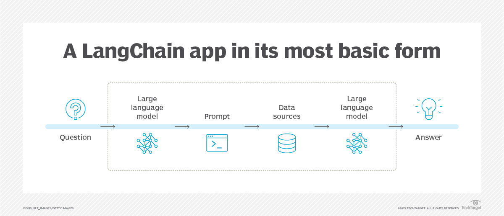

# LangChain: The Pioneer of AI Agent Frameworks


*LangChain's chain-based architecture for building AI applications*

## What is LangChain?

LangChain is an open-source framework designed to simplify the development of applications using large language models (LLMs). It provides a standardized interface for chains, lots of integrations with other tools, and end-to-end chains for common applications.

Founded by Harrison Chase in October 2022, LangChain has quickly become one of the most popular frameworks for working with LLMs, boasting over 65,000 GitHub stars and a thriving community.

## Core Architecture: Chain-Based Thinking

The fundamental concept behind LangChain is the "chain" - a sequence of calls (to an LLM, to a tool, to a data source, etc.) that are combined to solve a task. This approach is inspired by functional programming, where complex operations are built by composing simpler functions.


*Image placeholder: Visual representation of a LangChain workflow with multiple components*

### Key Components

1. **Models**: Integrations with various LLMs from providers like OpenAI, Anthropic, and Hugging Face
2. **Prompts**: Templates and management for system prompts
3. **Memory**: State persistence between chain runs
4. **Indexes**: Tools for efficiently retrieving relevant information
5. **Chains**: Sequences of operations that can be composed together
6. **Agents**: Entities that use LLMs to determine which actions to take

## Why Choose LangChain?

### Strengths

1. **Modularity**: LangChain's component-based design allows you to easily swap parts in and out, making it adaptable to different use cases.

2. **Extensive Integrations**: With over 50 integrations to different data sources, APIs, and other tools, LangChain can connect to almost anything.

3. **Comprehensive Documentation**: As one of the most mature frameworks, LangChain has extensive documentation and examples.

4. **Active Community**: A large user base means plenty of resources, tutorials, and help available.

5. **Rapid Development**: The pre-built chains and components allow for quick prototyping and development.

### Real-World Applications

LangChain excels in several key application areas:

- **Document Q&A**: Building systems that can answer questions based on specific documents
- **Chatbots**: Creating conversational agents with memory
- **Data Analysis**: Processing and analyzing structured data with LLMs
- **Code Analysis**: Leveraging LLMs to understand and work with codebases
- **Autonomous Agents**: Creating goal-directed agents that can use tools

## Detailed Code Examples

### Basic Chain Example

```python
from langchain.chains import LLMChain
from langchain.llms import OpenAI
from langchain.prompts import PromptTemplate

# Define a prompt template
template = "Explain {concept} in simple terms."
prompt = PromptTemplate(template=template, input_variables=["concept"])

# Initialize the LLM
llm = OpenAI(temperature=0.7)

# Create and run a basic chain
chain = LLMChain(llm=llm, prompt=prompt)
response = chain.run(concept="quantum computing")
print(response)
```

### RAG Implementation

```python
from langchain.embeddings import OpenAIEmbeddings
from langchain.vectorstores import Chroma
from langchain.text_splitter import CharacterTextSplitter
from langchain.llms import OpenAI
from langchain.chains import RetrievalQA
from langchain.document_loaders import TextLoader

# Load document
loader = TextLoader('my_document.txt')
documents = loader.load()

# Split text into chunks
text_splitter = CharacterTextSplitter(chunk_size=1000, chunk_overlap=0)
texts = text_splitter.split_documents(documents)

# Create embeddings and vector store
embeddings = OpenAIEmbeddings()
db = Chroma.from_documents(texts, embeddings)

# Create a retrieval-based QA chain
qa = RetrievalQA.from_chain_type(
    llm=OpenAI(),
    chain_type="stuff",
    retriever=db.as_retriever()
)

# Ask a question
query = "What are the main points in the document?"
response = qa.run(query)
print(response)
```

### Simple Agent Example

```python
from langchain.agents import initialize_agent, Tool
from langchain.agents import AgentType
from langchain.llms import OpenAI
from langchain.utilities import SerpAPIWrapper

# Set up a search tool
search = SerpAPIWrapper()
tools = [
    Tool(
        name="Search",
        func=search.run,
        description="Useful for searching the internet for current information"
    )
]

# Initialize an agent with the tools
llm = OpenAI(temperature=0)
agent = initialize_agent(
    tools, 
    llm, 
    agent=AgentType.ZERO_SHOT_REACT_DESCRIPTION,
    verbose=True
)

# Run the agent
agent.run("What's the latest news about AI regulation?")
```

## Limitations and Challenges

While LangChain is powerful for many use cases, it has some notable limitations:

1. **Complex Multi-Agent Systems**: As the number of agents increases, LangChain's chain-based approach becomes increasingly difficult to manage.

2. **Limited Built-in State Management**: The state management in LangChain is fairly basic, which can be problematic for complex applications.

3. **Overhead for Simple Applications**: For very simple LLM applications, LangChain may introduce unnecessary complexity.

4. **Learning Curve for Advanced Features**: While basic chains are straightforward, mastering advanced features like custom tools and complex agents requires significant investment.

5. **Evolving API**: As the library continues to develop rapidly, breaking changes can occur.

## When to Use LangChain

LangChain is an excellent choice when:

- You're building a relatively straightforward LLM application
- You need RAG capabilities
- You want to prototype quickly with minimal setup
- Your application follows a sequential processing flow
- You value extensive integrations with other tools and services

It may not be the best choice when:

- You need complex multi-agent collaboration
- You require sophisticated state management
- You're building a system with complex, non-linear workflows
- You need fine-grained control over agent interactions

## Getting Started with LangChain

### Installation

```bash
pip install langchain
pip install openai  # Or another LLM provider
```

### Resources

- [Official Documentation](https://python.langchain.com/docs/get_started)
- [GitHub Repository](https://github.com/langchain-ai/langchain)
- [LangChain Cookbook](https://github.com/langchain-ai/langchain/tree/master/cookbook)

## Conclusion

LangChain remains one of the most versatile and accessible AI agent frameworks available. Its modular design, extensive integrations, and active community make it an excellent starting point for developers new to LLM application development.

While it may not be the optimal solution for every use case, particularly complex multi-agent systems, its flexibility and comprehensive documentation mean that it will likely remain a cornerstone of the LLM application ecosystem.

For hands-on examples and executable code, check out our [LangChain Examples Notebook](https://colab.research.google.com/github/Shubham-vish/prepwithai_tutorials/blob/main/Agents/Notebooks/LangChain_Examples.ipynb).