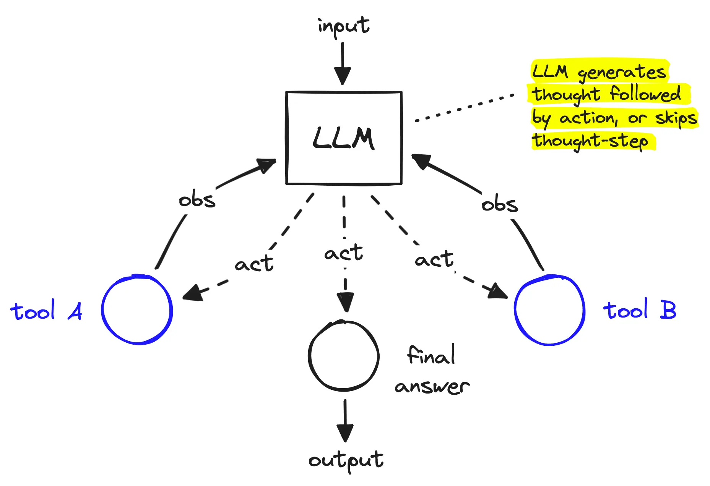
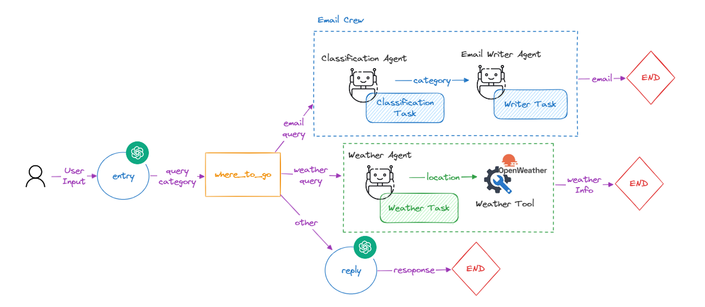

# LangGraph: Advanced Workflow Orchestration for AI Agents


*Visualization of LangGraph's directed graph structure*

## Helpful Resources

- [Official LangGraph Documentation](https://python.langchain.com/docs/langgraph)
- [LangGraph GitHub Repository](https://github.com/langchain-ai/langgraph)
- [LangGraph Concepts Guide](https://python.langchain.com/docs/langgraph/concepts)
- [LangGraph Tutorial](https://python.langchain.com/docs/langgraph/quick_start)
- [LangGraph API Reference](https://api.python.langchain.com/en/latest/langgraph_api_reference.html)
- [LangChain Blog: LangGraph](https://blog.langchain.dev/langgraph/)
- [LangChain AI YouTube Tutorials](https://www.youtube.com/c/LangChainAI)


For hands-on examples and executable code, check out our [LangGraph Examples Notebook](https://colab.research.google.com/github/Shubham-vish/prepwithai_tutorials/blob/main/Agents/Notebooks/LangGraph_Examples.ipynb).

## What is LangGraph?

LangGraph is an advanced framework built on top of LangChain that specializes in creating complex, stateful workflows for AI agent applications. Developed by the LangChain team, it extends LangChain's capabilities with sophisticated graph-based execution patterns, particularly focusing on cyclical execution flows.

While LangChain provides the building blocks for creating AI applications, LangGraph offers the structure to orchestrate these components into more complex, non-linear workflows with advanced state management.

## Core Architecture: Graph-Based Workflows

At its core, LangGraph implements a **graph-based architecture** that represents workflows as nodes connected by directed edges. This approach allows for:

- Non-linear execution paths
- Conditional branching and looping
- Sophisticated state management
- Complex decision trees


*Screenshot of LangGraph's workflow visualization tools*

### Key Components

1. **StateGraph**: The core class for defining graph-based workflows
2. **Nodes**: Individual processing units that perform specific functions
3. **Edges**: Connections between nodes that define execution flow
4. **State Management**: Tools for maintaining and updating application state
5. **Conditional Logic**: Rules for determining which paths to follow in the graph
6. **Visualization**: Built-in tools for visualizing and debugging workflows

## Why Choose LangGraph?

### Strengths

1. **Advanced Workflow Control**: LangGraph excels at creating sophisticated flow control mechanisms, including cyclical processes, that go far beyond simple sequential chains.

2. **Superior State Management**: The framework provides robust state management capabilities, essential for complex applications requiring persistent context.

3. **Conditional Execution**: LangGraph enables fine-grained conditional logic to determine execution paths, creating more dynamic and responsive agent behaviors.

4. **Building on LangChain's Foundation**: As an extension of LangChain, LangGraph leverages its extensive ecosystem of integrations and components.

5. **Visualization Tools**: Built-in tools for visualizing workflows make it easier to understand and debug complex agent systems.

### Real-World Applications

LangGraph is particularly well-suited for:

- **Complex Decision Systems**: Applications requiring sophisticated decision trees
- **Iterative Processing**: Workflows that need to cycle back based on certain conditions
- **Multi-Step Reasoning**: Implementing step-by-step reasoning processes with validation
- **Stateful Applications**: Systems requiring persistent state across interactions
- **Advanced Agent Behaviors**: Creating agents with complex, non-linear behavior patterns

## Detailed Code Examples

### Basic Graph with Multiple Paths

```python
from langgraph.graph import StateGraph
from langchain.chat_models import ChatOpenAI
from langchain.schema import HumanMessage
import json

# Define our state
class GraphState:
    def __init__(self):
        self.question = ""
        self.response = ""
        self.difficulty = ""

# Define nodes in the graph
def analyze_question(state):
    """Analyze the question and determine its difficulty."""
    llm = ChatOpenAI()
    response = llm.invoke([HumanMessage(content=f"Analyze this question and classify it as 'easy', 'medium', or 'hard': {state.question}")])
    state.difficulty = response.content.strip().lower()
    return state

def answer_easy_question(state):
    """Process easy questions."""
    llm = ChatOpenAI()
    response = llm.invoke([HumanMessage(content=f"Please answer this easy question briefly: {state.question}")])
    state.response = response.content
    return state

def answer_complex_question(state):
    """Process medium or hard questions with more detail."""
    llm = ChatOpenAI()
    response = llm.invoke([HumanMessage(content=f"Please answer this {state.difficulty} question in detail, with examples: {state.question}")])
    state.response = response.content
    return state

# Create the graph
workflow = StateGraph(GraphState)

# Add nodes
workflow.add_node("analyze_question", analyze_question)
workflow.add_node("answer_easy", answer_easy_question)
workflow.add_node("answer_complex", answer_complex_question)

# Add edges with conditional logic
workflow.add_edge("analyze_question", "answer_easy", condition=lambda state: state.difficulty == "easy")
workflow.add_edge("analyze_question", "answer_complex", condition=lambda state: state.difficulty in ["medium", "hard"])

# Set the entry point
workflow.set_entry_point("analyze_question")

# Compile the graph
graph = workflow.compile()

# Execute the graph
initial_state = GraphState()
initial_state.question = "What is the capital of France?"
result = graph.invoke(initial_state)

print(f"Question difficulty: {result.difficulty}")
print(f"Response: {result.response}")
```

### Cyclic Graph for Iterative Reasoning

```python
from langgraph.graph import StateGraph
from langchain.chat_models import ChatOpenAI
from langchain.schema import HumanMessage
import json

# Define state type
class AgentState:
    def __init__(self):
        self.problem = ""
        self.current_solution = ""
        self.steps_taken = []
        self.iterations = 0
        self.max_iterations = 3
        self.complete = False

# Define nodes
def decompose_problem(state):
    """Break down the problem into steps."""
    if not state.steps_taken:  # Only decompose on first pass
        llm = ChatOpenAI()
        response = llm.invoke([HumanMessage(content=f"Break this problem into clear steps that need to be solved: {state.problem}")])
        state.steps_taken = response.content.split("\n")
        state.current_solution = "Problem decomposed into steps."
    return state

def solve_step(state):
    """Work on the current step of the solution."""
    llm = ChatOpenAI()
    current_step = state.steps_taken[min(state.iterations, len(state.steps_taken)-1)]
    previous_work = state.current_solution
    
    prompt = f"""
    Problem: {state.problem}
    Previous work: {previous_work}
    Current step to solve: {current_step}
    
    Provide the next part of the solution focusing on this step.
    """
    
    response = llm.invoke([HumanMessage(content=prompt)])
    state.current_solution += "\n\n" + response.content
    return state

def evaluate_solution(state):
    """Evaluate if the solution is complete or needs another iteration."""
    state.iterations += 1
    
    if state.iterations >= state.max_iterations:
        state.complete = True
        return state
    
    llm = ChatOpenAI()
    prompt = f"""
    Problem: {state.problem}
    Current solution: {state.current_solution}
    
    Is this solution complete? Answer only 'complete' or 'incomplete'.
    """
    
    response = llm.invoke([HumanMessage(content=prompt)])
    state.complete = "complete" in response.content.lower()
    return state

# Create the graph
workflow = StateGraph(AgentState)

# Add nodes
workflow.add_node("decompose", decompose_problem)
workflow.add_node("solve", solve_step)
workflow.add_node("evaluate", evaluate_solution)

# Add edges including cyclic edges
workflow.add_edge("decompose", "solve")
workflow.add_edge("solve", "evaluate")
workflow.add_edge("evaluate", "solve", condition=lambda state: not state.complete)

# Set the entry point
workflow.set_entry_point("decompose")

# Create a state and execute the graph
initial_state = AgentState()
initial_state.problem = "Design a simple recommendation system for an online bookstore."
result = workflow.invoke(initial_state)

print(f"Final solution after {result.iterations} iterations:")
print(result.current_solution)
```

### Agent with Memory and External Tools

```python
from langgraph.graph import StateGraph
from langchain.chat_models import ChatOpenAI
from langchain.schema import HumanMessage
from langchain.tools import WikipediaQueryRun
from langchain.utilities import WikipediaAPIWrapper
import json

# Create a Wikipedia tool
wikipedia = WikipediaQueryRun(api_wrapper=WikipediaAPIWrapper())

# Define state type
class ResearchState:
    def __init__(self):
        self.query = ""
        self.needs_research = False
        self.research_results = ""
        self.final_answer = ""
        self.complete = False

# Define nodes
def analyze_query(state):
    """Determine if the query requires research."""
    llm = ChatOpenAI()
    prompt = f"Does the query '{state.query}' require looking up factual information? Answer only 'yes' or 'no'."
    response = llm.invoke([HumanMessage(content=prompt)])
    state.needs_research = "yes" in response.content.lower()
    return state

def conduct_research(state):
    """Use Wikipedia to research the query."""
    if state.needs_research:
        try:
            state.research_results = wikipedia.run(state.query)
        except Exception as e:
            state.research_results = f"Error conducting research: {str(e)}"
    return state

def formulate_answer(state):
    """Generate a final answer based on research or direct knowledge."""
    llm = ChatOpenAI()
    
    if state.needs_research and state.research_results:
        prompt = f"""
        Query: {state.query}
        Research findings: {state.research_results}
        
        Based on this information, please provide a comprehensive answer to the query.
        """
    else:
        prompt = f"Please answer this question based on your knowledge: {state.query}"
    
    response = llm.invoke([HumanMessage(content=prompt)])
    state.final_answer = response.content
    state.complete = True
    return state

# Create the graph
workflow = StateGraph(ResearchState)

# Add nodes
workflow.add_node("analyze", analyze_query)
workflow.add_node("research", conduct_research)
workflow.add_node("answer", formulate_answer)

# Add edges with conditional logic
workflow.add_edge("analyze", "research", condition=lambda state: state.needs_research)
workflow.add_edge("analyze", "answer", condition=lambda state: not state.needs_research)
workflow.add_edge("research", "answer")

# Set the entry point
workflow.set_entry_point("analyze")

# Create a state and execute the graph
initial_state = ResearchState()
initial_state.query = "What were the major achievements of Alan Turing?"
result = workflow.invoke(initial_state)

print(f"Needed research: {result.needs_research}")
print(f"Final answer: {result.final_answer}")
```

## Limitations and Challenges

While LangGraph provides powerful capabilities for complex AI workflows, it has some notable limitations:

1. **Learning Curve**: As an extension of LangChain, it requires understanding both frameworks, resulting in a steeper learning curve.

2. **Complexity for Simple Tasks**: For straightforward applications, LangGraph may introduce unnecessary complexity compared to simpler frameworks.

3. **Evolving API**: As a newer framework, the API is still evolving, which may lead to breaking changes in future versions.

4. **Documentation Gaps**: Some advanced features have limited documentation or examples.

5. **Debugging Challenges**: Complex graph structures can be difficult to debug when issues arise.

## When to Use LangGraph

LangGraph is an excellent choice when:

- You need sophisticated workflow control with conditional branching and looping
- Your application requires persistent state management
- You're already using LangChain and need to extend its capabilities
- You're building systems with complex, non-linear interaction patterns
- Your use case demands advanced reasoning patterns like recursive thinking

It may not be the best choice when:

- You're building simple, linear workflows
- You're new to AI agent frameworks and prefer a gentler learning curve
- Your application doesn't require complex state management
- You need a standalone framework rather than one built on top of another

## Getting Started with LangGraph

### Installation

```bash
pip install langgraph
pip install langchain  # LangChain is a prerequisite
```

### Resources

- [Official Documentation](https://python.langchain.com/docs/langgraph)
- [GitHub Repository](https://github.com/langchain-ai/langgraph)
- [LangGraph Examples](https://github.com/langchain-ai/langgraph/tree/main/examples)
- [Tutorial Blog Posts](https://blog.langchain.dev/category/langgraph/)

## Conclusion

LangGraph represents the next evolution in AI agent frameworks, offering sophisticated workflow orchestration capabilities that go beyond the linear chains of earlier frameworks. Its graph-based approach allows for complex, non-linear execution patterns that can better model real-world reasoning processes.

While it has a steeper learning curve than some alternatives, LangGraph's powerful state management and conditional branching make it uniquely suited for advanced AI applications requiring complex decision-making and iterative processing. As an extension of LangChain, it also benefits from the rich ecosystem of integrations and components that LangChain provides.

For developers already familiar with LangChain who need more sophisticated workflow capabilities, LangGraph offers a natural progression path to building more complex AI agent systems.

For hands-on examples and executable code, check out our [LangGraph Examples Notebook](https://colab.research.google.com/github/Shubham-vish/prepwithai_tutorials/blob/main/Agents/Notebooks/LangGraph_Examples.ipynb).