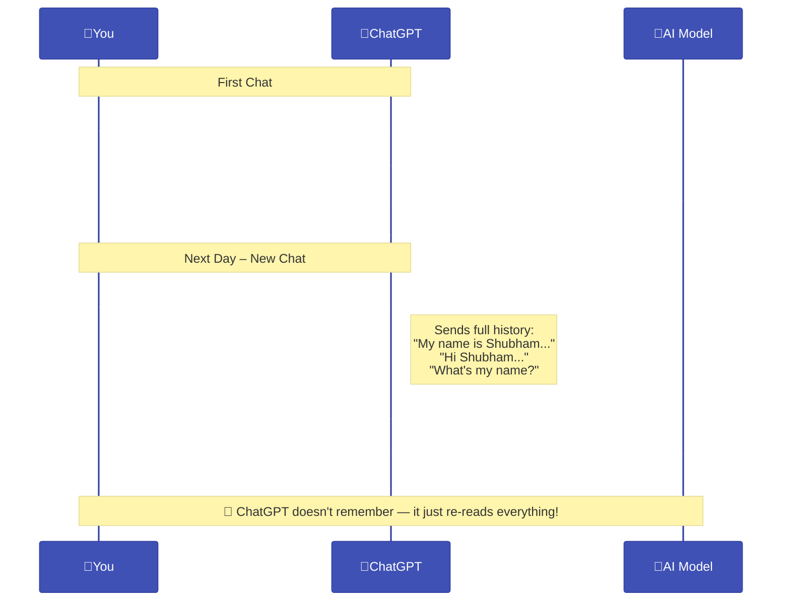
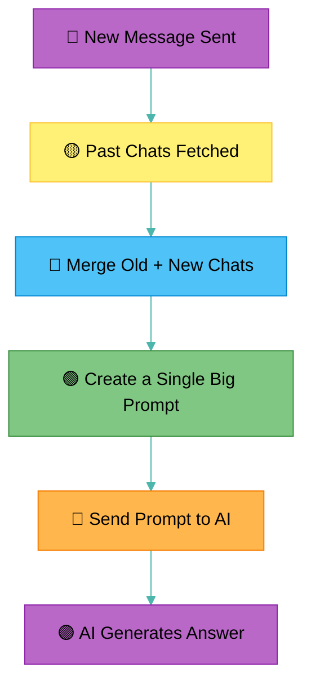

# 🤖 ChatGPT Yaad Rakhta Hai... Ya Nahi?

## 📍 The Myth:
**"LLMs (like ChatGPT) tumhari purani baatein yaad rakhte hain..."**

**❌ Galat soch!**  
LLMs *actually kuch bhi yaad nahi rakhte*. Har baar tum ek naya message bhejte ho —  
vo usse **ek fresh query** ke tarah treat karta hai.

---

## 🔍 Asli Sach: Kaise “Memory” ka Illusion Create Hota Hai?

LLM ka model zero memory pe kaam karta hai.  
Jo bhi purani chat tumne ki hai, vo **AI ko yaad nahi hoti.**  
To fir vo context kaise maintain karta hai?

### 💡 Answer: Prompt Engineering & History Replay

> **Backend me purani messages ko dobara combine karke ek bada prompt bana diya jata hai.**  
> Ye prompt fir se model ko diya jata hai — tab tumhe lagta hai ki ChatGPT yaad rakh raha hai.

---

## 🧠 Visual Diagram: Illusion of Memory

---

## 🎯 Real Flow Behind the Curtain

---

## 😲 Toh Fir Memory Kya Hai?

### 💭 “Memory” = Illusion hai jo app create karti hai:

- LLM ko context “remind” karwaya jaata hai
- Har baar puri chat history ke sath
- Jitna zyada prompt, utna zyada tokens = cost

---

## 🧠 Takeaway:

> ChatGPT yaad nahi rakhta — **use yaad dilaya jata hai.**  
> Tumhara pura conversation history *dobara bhej diya jaata hai* har baar.

---

## 🗣️ Reel CTA Ideas:

- "Agar tumhe laga ChatGPT yaad rakhta hai to ab comment karo: **'Fake Memory!'**"
- "Is illusion ko samjhaane ke liye video save karlo — knowledge ka nasha ho jayega!"
- "Aise aur secrets chahiye AI ke? Follow karlo abhi!"
