# Building a Multi-Agent AI System: Beyond the Single Agent Approach

## Introduction

Single AI agent is not enough. You need a team — where each agent is a specialist in a specific task.

Why? Because although a single AI agent can handle multiple tasks simultaneously, it often lacks accuracy when juggling too many responsibilities at once.

## The Content Creation Example

Let's take the example of building an AI-powered content creation system. Here's how a multi-agent approach would work:

1. **Content Planner Agent**: First, a planning agent develops the content structure and outline
2. **Research Agent**: Next, a research specialist gathers relevant information and data
3. **Writer Agent**: The writer then creates a script based on the plan and research
4. **Fact-Checker Agent**: A fact-checker verifies all information for accuracy
5. **Reviewer Agent**: Finally, a reviewer evaluates the content and provides feedback

This creates a feedback loop where:
- The writer revises content based on reviewer feedback
- The reviewer evaluates the revised content
- This cycle continues until the reviewer approves

At the end of this process, you have a polished, high-quality final script.

## Creating an Effective Agent Team

The most important aspect of building a multi-agent system is understanding how these agents collaborate and think systematically.

In this blog series, we'll build and deploy a complete AI agent system featuring multiple specialized agents. We'll discuss everything from the technical stack and frameworks to the architecture needed to make it work effectively.

## System Architecture Visualization

Below is a detailed flowchart showing the complete multi-agent system architecture:

```mermaid
flowchart TD
    %% Style Definitions
    classDef planner fill:#FFD700,stroke:#333,stroke-width:1px,color:#000;
    classDef research fill:#FFADAD,stroke:#333,stroke-width:1px,color:#000;
    classDef writer fill:#90EE90,stroke:#333,stroke-width:1px,color:#000;
    classDef checker fill:#ADD8E6,stroke:#333,stroke-width:1px,color:#000;
    classDef reviewer fill:#DDA0DD,stroke:#333,stroke-width:1px,color:#000;
    classDef final fill:#C0C0C0,stroke:#000,stroke-width:2px,color:#000,font-weight:bold;
    classDef decision fill:#333,stroke:#222,color:#fff;

    %% Main Nodes
    A(["<br>📩 User Input<br><sub>Initial content idea or topic</sub><br>&nbsp;"])
    B(["<br>📋 Content Planner Agent<br><sub>Breaks the idea into a structured content outline</sub><br>&nbsp;"]):::planner
    C(["<br>🔍 Research Agent <br><sub>Finds supporting data, examples, or trends</sub><br>&nbsp;"]):::research
    D(["<br>✍️ Writer Agent<br><sub>Creates the first script using plan and research</sub><br>&nbsp;"]):::writer
    E(["<br>✔️ Fact Checker Agent<br><sub>Verifies claims, numbers, and source accuracy</sub><br>&nbsp;"]):::checker
    F(["<br>🧠 Reviewer Agent<br><sub>Refines flow, tone, and provides feedback</sub><br>&nbsp;"]):::reviewer
    G{<br>✅ Approved?<br>&nbsp;}:::decision
    H(["<br>🎯 Final Polished Script<br><sub>Final version after review loop</sub><br>&nbsp;"]):::final

    %% Flow Logic
    A --> B --> C --> D --> E --> F
    F --> G
    G -- ❌ No --> D
    G -- ✔️ Yes --> H
    F -->|💬 Feedback| D


```

## Implementation Frameworks

In the upcoming posts, we'll explore different frameworks that make building multi-agent systems easier:

1. **LangChain** - For connecting large language models to other sources of data
2. **CrewAI** - For orchestrating multiple AI agents in a team
3. **AutoGen** - For building conversational agents that can interact with each other
4. **LangGraph** - For creating complex workflows with multiple agents

## Conclusion

Building multi-agent AI systems represents the next evolution in AI application development. By distributing specialized tasks across multiple agents, we can create more robust, accurate, and capable AI systems than what's possible with single-agent approaches.

Stay tuned for the next post in this series, where we'll dive deeper into the technical implementation of our first agent team.

---

*Are you interested in learning more about AI agent frameworks? Leave a comment below!*
