# ChatGPT Doesn't Remember You (But It Seems Like It Does!)

## The Magic Trick Behind AI Chat Memory

Did you know? ChatGPT and other AI chatbots **don't actually remember** your conversations! Yet somehow, they respond as if they know exactly what you talked about before. It's like a magic trick happening behind the scenes!

## How AI Memory Really Works 🧠

Imagine talking to someone with complete amnesia. Every time you speak, they've forgotten what you just said! That's exactly how AI chatbots naturally work.

```mermaid
%%{init: {'theme':'forest', 'themeVariables': { 'primaryColor': '#ff9800', 'primaryTextColor': '#fff', 'primaryBorderColor': '#ff9800', 'lineColor': '#ff9800', 'secondaryColor': '#006699', 'tertiaryColor': '#fff' }}}%%
sequenceDiagram
    participant User as 😀 You
    participant LLM as 🤖 Raw AI
    
    User->>LLM: What's the weather today?
    LLM->>User: I don't have real-time data
    User->>LLM: I meant in my previous example
    LLM-->>User: 🤔 What example? I don't remember anything!
    
    Note over User,LLM: Without memory tricks, AI forgets everything!
```

## The Magic Trick: How ChatGPT Seems to Remember 🪄

So how does ChatGPT seem to remember what you said earlier? It's a clever trick! The app saves your entire conversation and feeds it back to the AI each time.

```mermaid
%%{init: {'theme':'forest', 'themeVariables': { 'primaryColor': '#8a2be2', 'primaryTextColor': '#fff', 'primaryBorderColor': '#8a2be2', 'lineColor': '#00bfff', 'secondaryColor': '#ff1493', 'tertiaryColor': '#fff' }}}%%
sequenceDiagram
    participant User as 😀 You
    participant Backend as 📱 ChatGPT App
    participant DB as 💾 Memory Bank
    participant LLM as 🧠 AI Brain
    
    User->>Backend: "Hi there!"
    Backend->>DB: Save: "Hi there!"
    Backend->>LLM: Send: "Hi there!"
    LLM->>Backend: "Hello! How can I help?"
    Backend->>DB: Save AI response
    Backend->>User: Show: "Hello! How can I help?"
    
    User->>Backend: "Tell me about dogs"
    Backend->>DB: Get all previous messages
    Backend->>LLM: Send EVERYTHING: ["Hi there!" + "Hello! How can I help?" + "Tell me about dogs"]
    LLM->>Backend: Response about dogs
    Backend->>DB: Save new response
    Backend->>User: Show: Response about dogs
    
    Note over User,LLM: The AI sees the ENTIRE conversation each time!
```

## How It Works Behind the Curtain 🎭

It's like giving the AI a cheat sheet each time you talk to it:

1. **Save Everything**: Every message (yours and the AI's) gets saved
2. **Bundle It All Together**: When you send a new message, the app:
   - Grabs all your old messages 💬
   - Adds all the AI's previous answers 🤖
   - Attaches your new question ❓
3. **One Big Package**: This entire conversation bundle goes to the AI each time

```mermaid
%%{init: {'theme':'forest', 'themeVariables': { 'primaryColor': '#4CAF50', 'primaryTextColor': '#fff', 'primaryBorderColor': '#4CAF50', 'lineColor': '#FF5722', 'secondaryColor': '#2196F3', 'tertiaryColor': '#fff' }}}%%
flowchart TD
    subgraph "What You Think Is Happening" 
        A[🙂 You: Ask a question]
        B[🤖 ChatGPT: Remembers and answers]
        style A fill:#FFD54F,stroke:#FFB300,color:black
        style B fill:#FFD54F,stroke:#FFB300,color:black
    end
    
    subgraph "What REALLY Happens Behind the Scenes"
        C[📱 Your message goes to server]
        D[🔍 Server finds your chat history]
        E[📦 Everything bundled together]
        F[📨 ENTIRE bundle sent to AI]
        G[✨ AI creates response]
        style C fill:#81C784,stroke:#4CAF50,color:black
        style D fill:#81C784,stroke:#4CAF50,color:black
        style E fill:#81C784,stroke:#4CAF50,color:black
        style F fill:#81C784,stroke:#4CAF50,color:black
        style G fill:#81C784,stroke:#4CAF50,color:black
    end
    
    A --> C
    C --> D
    D --> E
    E --> F
    F --> G
    G --> B
    
    style A stroke-width:3px
    style B stroke-width:3px
    style C stroke-width:3px
    style D stroke-width:3px
    style E stroke-width:3px
    style F stroke-width:3px
    style G stroke-width:3px
```

## Why Should You Care? 🤔

This clever trick has some interesting effects:

- **Memory Limits**: There's only so much chat history that can fit (called "tokens")
- **More Talk = More Cost**: Long conversations cost companies more money
- **Privacy Matters**: Your entire chat has to be saved somewhere

## The Simple Truth About AI Memory 💡

AI chatbots don't actually remember — they just get reminded each time! 

It's like if your friend had amnesia, but before each conversation, someone whispered everything you've ever said to them. They'd seem to remember you, but they're actually starting fresh each time!

So next time ChatGPT seems to recall your last conversation, now you know the secret: it's not remembering you, it's just being shown your entire chat history every time you hit send! 🪄✨
