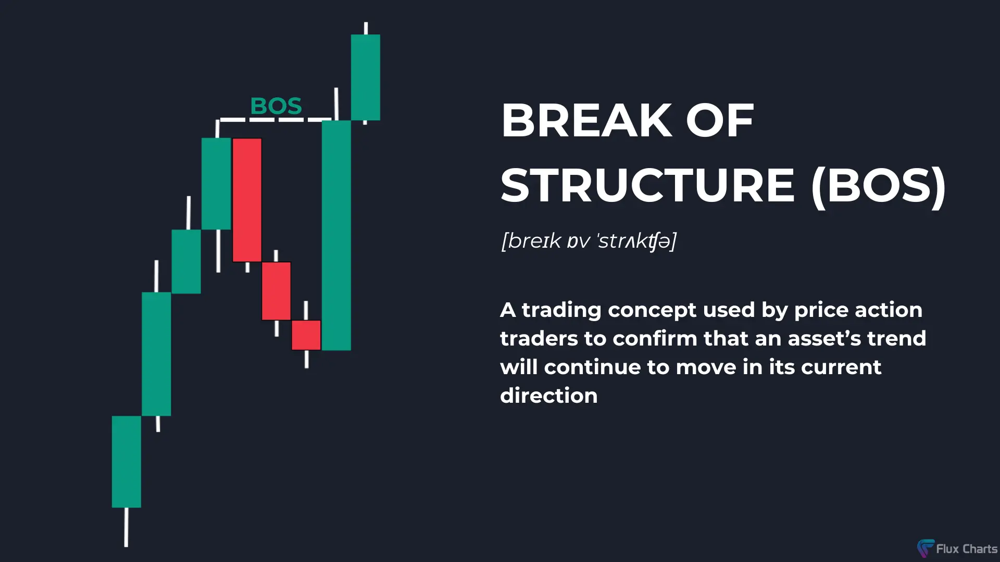
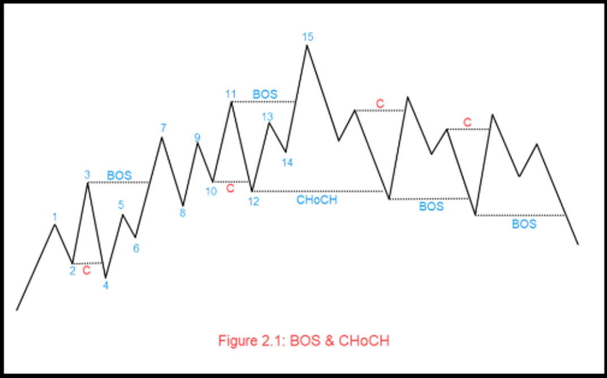

# Break of Structure (BOS): A Key Concept in Smart Money Concepts

### Introduction

**Break of Structure (BOS)** is a pivotal concept in **Smart Money Concepts (SMC)** and is used by price action traders to confirm the continuation of an asset's trend. It acts as a strong indicator for traders to understand market momentum and direction, helping them refine their strategies. 

In this blog, we will:
- Define what a BOS is.
- Learn how to identify bullish and bearish BOS.
- Understand the rules for a valid BOS.
- Explore the theory and strategies behind BOS.

---

### What is a Break of Structure (BOS)?

A **Break of Structure (BOS)** signals the continuation of the current market structure. It occurs when the price of an asset decisively breaks a significant level, such as a swing high or swing low, indicating that the current trend will likely persist.

- A **Bullish BOS** suggests that the asset's price will continue to rise.
- A **Bearish BOS** indicates that the price will likely continue to fall.

This confirmation helps traders remain aligned with the prevailing trend.

---

### Rules for a Valid Break of Structure (BOS)

To validate a Break of Structure, two key rules must be met:

#### 1. **Liquidity Sweep**
- In an uptrend, pullbacks act as support levels where traders place stop-losses below. These areas have high liquidity.
- The price must sweep the liquidity below the previous pullback before confirming the BOS.
- In the above chart the Liquidity Sweep areas are marked as Red color C.

#### 2. **Cross the Previous High or Low**
- After sweeping liquidity, the price must break the previous swing high in an uptrend or the previous swing low in a downtrend.
- A valid BOS is confirmed only if the candle body closes above the previous high (bullish BOS) or below the previous low (bearish BOS).

**Important Note:** A mere wick crossing the level does not constitute a valid BOS; a strong candle closure is essential.

---

### How to Identify a Break of Structure (BOS)

#### Bullish Break of Structure (BOS)

A bullish BOS forms when:
1. A **higher low (HL)** is established, meaning the current low is higher than the previous low.
2. The price breaks above the previous **higher high (HH)**, with a candle body closing above the high.

**Example:**
- Identify an uptrend with higher highs and higher lows.
- Look for a liquidity sweep below the previous low.
- Confirm the BOS with a strong candle closure above the previous high.

#### Bearish Break of Structure (BOS)

A bearish BOS forms when:
1. A **lower high (LH)** is established, meaning the current high is lower than the previous high.
2. The price breaks below the previous **lower low (LL)**, with a candle body closing below the low.

**Example:**
- Identify a downtrend with lower highs and lower lows.
- Look for a liquidity sweep above the previous high.
- Confirm the BOS with a strong candle closure below the previous low.

> **Placeholder for Image**: Add charts showcasing valid bullish and bearish BOS examples.

---

### Why is BOS Important?

A BOS provides traders with confirmation that the current market trend is likely to continue. It helps:
1. **Validate Market Momentum**: By confirming the continuation of the trend.
2. **Filter False Breakouts**: Ensures the price moves decisively above or below critical levels.
3. **Align Strategies**: Helps traders remain in sync with institutional movements.

---

### The Role of Liquidity in BOS

Liquidity plays a vital role in forming a BOS. Before a valid BOS occurs, the market often sweeps liquidity from high-activity zones:
- **In an Uptrend**: Liquidity below support levels (stop-losses of buyers) is swept.
- **In a Downtrend**: Liquidity above resistance levels (stop-losses of sellers) is swept.

This liquidity sweep provides institutions the opportunity to accumulate or distribute their positions before the price continues in its intended direction.

---

### Trading Strategies Using BOS

#### Combining BOS with Change of Character (CHoCH)

BOS is often paired with a **Change of Character (CHoCH)** to refine trading strategies:
1. A CHoCH signals a potential reversal in market structure.
2. Traders enter positions (buy/sell) based on the CHoCH.
3. A BOS then confirms the continuation of the new trend, allowing traders to maintain their positions confidently.

#### Entry and Exit Points

While BOS itself is not a direct entry or exit signal, it serves as a confirmation:
- In a **Bullish BOS**, traders holding long positions can remain in the market.
- In a **Bearish BOS**, traders shorting the market can maintain their positions.

#### Integration with Points of Interest (POIs)

Traders can use BOS in conjunction with:
- **Order Blocks**: Zones of institutional activity.
- **Fair Value Gaps**: Areas of inefficiency in price movement.
- **Liquidity Zones**: High-activity levels on the chart.

---

### BOS vs. Market Structure Break (MSB)

Traders often confuse BOS with a **Market Structure Break (MSB)**:
- A BOS signals **continuation** of the current market trend.
- An MSB indicates a **reversal**, equivalent to a Change of Character (CHoCH+).

Understanding this distinction is crucial for developing effective trading strategies.

---

### Practical Tips for Using BOS

1. **Focus on Candle Closures**:
   - Always wait for the candle to close above/below the critical level to confirm the BOS.
2. **Use Multiple Timeframes**:
   - Identify BOS on higher timeframes for the trend and refine entries on lower timeframes.
3. **Pair with Risk Management**:
   - Use stop-losses just below/above the liquidity sweep to minimize risks.
4. **Combine with Liquidity Concepts**:
   - BOS is most effective when paired with liquidity sweeps and other SMC principles.

---

### Final Thoughts

The **Break of Structure (BOS)** is a powerful concept in trading, providing traders with the tools to confirm market trends and align with institutional movements. When combined with other SMC strategies such as liquidity sweeps and Points of Interest, BOS becomes an indispensable part of a trader’s toolkit.

Mastering BOS requires practice, patience, and an in-depth understanding of price action. By integrating BOS into your trading plan, you can enhance your ability to navigate complex market dynamics effectively.

**Jai Hind!**

