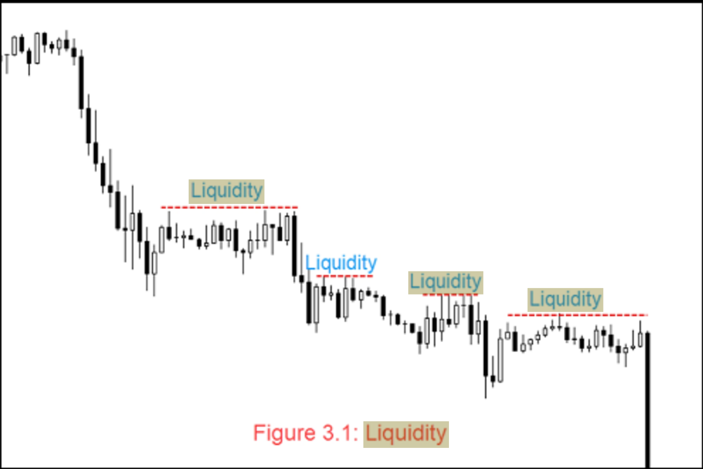
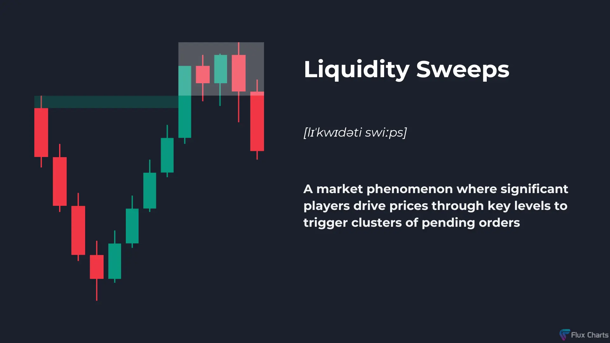
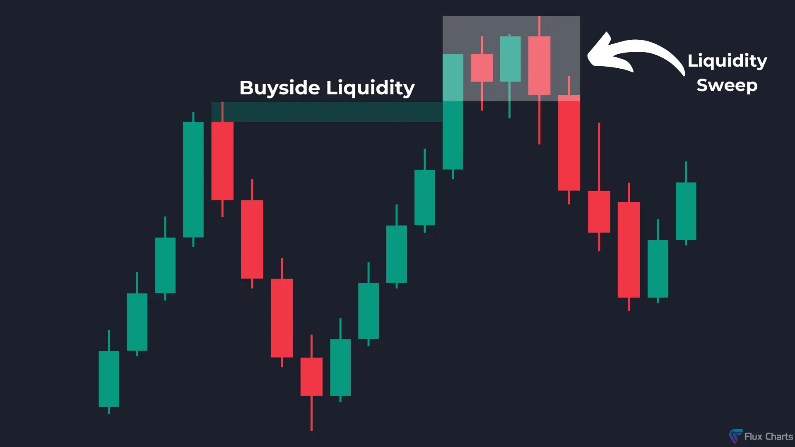
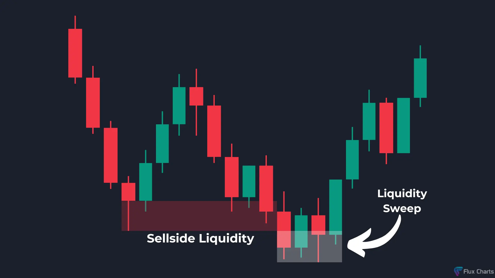

# Understanding Liquidity and Liquidity Sweep in Trading

### Introduction

The concept of **liquidity** forms the foundation of **Smart Money Concepts (SMC)** in trading. But what does liquidity actually mean? Let’s dive into the details to uncover its significance in the financial markets.

In this blog, we’ll explore:
- What liquidity is and how it works.
- The role of liquidity in trading.
- The concept of liquidity sweep and its application in market trends.

### What is Liquidity?

Liquidity refers to how easily an asset can be converted into cash without affecting its market price. It’s an essential aspect of any financial market and determines how quickly a trade can be executed.

#### Example:
Imagine this scenario:
- You own **gold worth ₹50 lakhs** and **a house worth ₹50 lakhs**.
- Now, you urgently need ₹50 lakhs in cash. Between gold and the house, which one can you sell faster?

**Answer:** Gold, because it is a highly liquid asset. Jewelry stores or other buyers can purchase gold almost instantly. In contrast, selling a house takes time due to finding buyers and negotiating terms.

**Key Insight:** Gold is more liquid because it has more readily available buyers and sellers. Similarly, liquidity in trading is about identifying zones where transactions can occur easily due to the presence of multiple market participants.

---

### Liquidity in Trading

In trading, liquidity works in the same way. Certain zones in the market have high liquidity because many buyers and sellers are present at those levels. These zones allow **big money players** (such as institutions) to enter or exit trades without significantly impacting prices.

---

## What is Liquidity Sweep?

Now that we understand liquidity, let’s move to the concept of **liquidity sweep**, which is a critical element of **Smart Money Concepts**.

### Understanding Liquidity Sweep

A liquidity sweep occurs when the market moves to absorb liquidity from high-activity zones before continuing in its primary trend. This process is common in both uptrends and downtrends.

#### Liquidity Sweep in an Uptrend

In an **uptrend**, the price does not move straight up. Instead, it alternates between **strong upward moves** and **pullbacks**. These pullbacks serve as temporary support levels.

- At these support levels, many traders place buy orders, while others place stop-loss orders just below these levels.
- These areas become **high liquidity zones** due to the accumulation of pending buy and sell orders.

When the price drops below these support levels, it triggers the stop-loss orders and pending buy orders. This process is called a **liquidity sweep**, where the market absorbs liquidity before resuming its upward movement.

#### Liquidity Sweep in a Downtrend

Similarly, in a **downtrend**, the price forms temporary resistance levels, where many traders place sell orders or stop-loss orders above these highs.

- When the price breaks above these resistance levels, it triggers pending sell orders and stop-losses.
- This action absorbs liquidity from the resistance zone, known as a **liquidity sweep**, before the price resumes its downward trend.

---

### Why is Liquidity Sweep Important?

Understanding liquidity sweeps can help traders:
- **Identify high-probability zones** where the market is likely to reverse.
- Recognize the movements of big players (institutions) who use liquidity sweeps to enter or exit trades.
- Avoid common retail traps like placing stop-loss orders too close to liquidity zones.

By aligning your trades with these liquidity movements, you can significantly improve your trading accuracy and results.

---

### Final Thoughts

Liquidity and liquidity sweeps are essential concepts in trading, especially when using **Smart Money Concepts**. Liquidity zones represent areas where significant trading activity occurs, and understanding how these zones function can give you an edge in the market.

If you want a detailed guide on liquidity sweeps or have questions, feel free to drop a comment or send me a message. 

**Stay tuned for more insights on Smart Money Concepts!**

**Jai Hind!**

