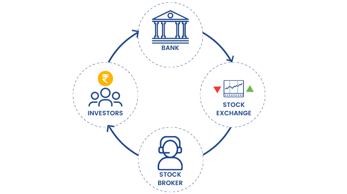
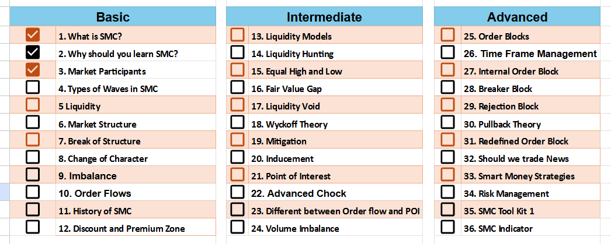
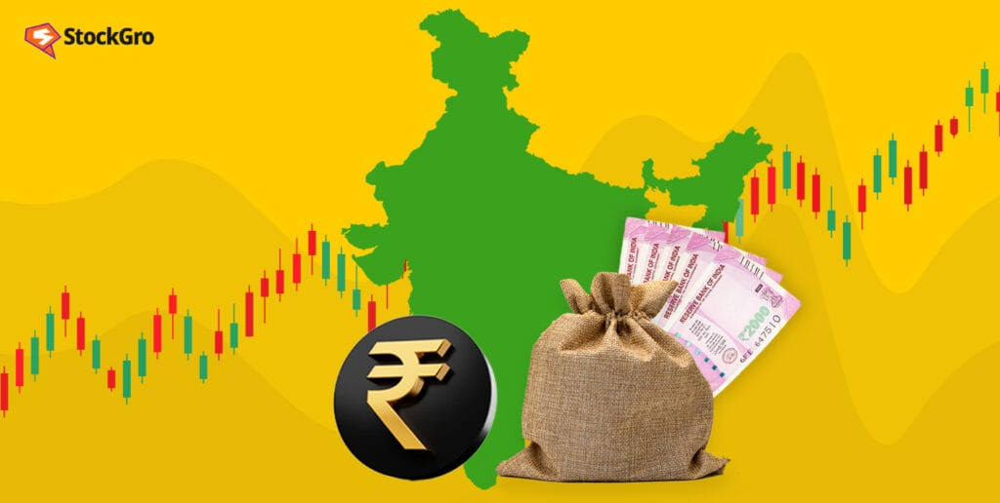
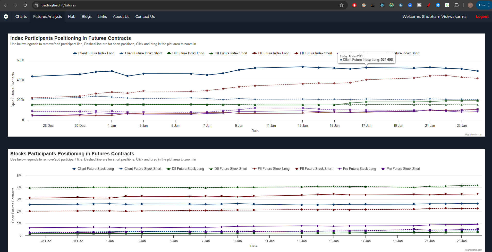

# Market Participants

## Introduction

"Who drives the market?" This is a question that intrigues almost everyone. Today, on **Day 3 of the Smart Money Concepts (SMC) series**, we will dive deep into the core participants of the Indian financial markets and their respective roles.

In the Indian stock market, there are four primary types of participants:

1. Foreign Institutional Investors (FIIs)
2. Domestic Institutional Investors (DIIs)
3. Proprietary Traders (Pro)
4. Retail Clients (Clients)

Understanding how these participants operate is key to mastering market dynamics and price movement.

This is part (3) of Smart Money Concepts Series:

## 1. **Foreign Institutional Investors (FIIs)**

FIIs refer to institutions based outside India that invest in the Indian markets. These include:

- **Hedge Funds**
- **Pension Funds**
- **Sovereign Wealth Funds**

### Characteristics of FIIs:
- **Purpose**: Their primary goal is to diversify their capital across various global markets, including India.
- **Capital Influence**: FIIs often trade in large volumes, and their activities can significantly impact market trends and liquidity.
- **Market Impact**: FIIs are considered trendsetters since they often drive major rallies or corrections in the markets.

---

## 2. **Domestic Institutional Investors (DIIs)**

DIIs are institutions based in India that invest in the domestic stock market. Examples include:

 

- **Life Insurance Corporation of India (LIC)**
- **Mutual Fund Houses**
- **Insurance Companies**

### Characteristics of DIIs:
- **Purpose**: They aim to invest funds collected from Indian investors (like mutual fund SIPs or insurance premiums) back into the Indian market.
- **Stability**: DIIs are often seen as stabilizers in the market, as they step in to buy during corrections and sell during overbought conditions.
- **Complementary Role**: DIIs often act in contrast to FIIs; when FIIs are selling, DIIs are buying, and vice versa.

---

## 3. **Proprietary Traders (Pro)**

Proprietary traders (often referred to as "Pro") include brokers and financial firms that trade using their own capital rather than trading on behalf of clients.

 

### Characteristics of Pro:
- **Short-Term Strategies**: Pro traders generally focus on exploiting short-term opportunities in the market, such as arbitrage, scalping, or momentum trading.
- **Expertise**: These participants have access to sophisticated tools, data, and algorithms that give them an edge over retail traders.
- **Volume Impact**: Though their trades are smaller compared to FIIs and DIIs, their high-frequency activity adds liquidity to the market.

---

## 4. **Retail Clients (Clients)**

Retail clients include individuals like you and me who trade through brokers. They form the majority of participants in terms of numbers but not in terms of capital.

 

### Characteristics of Clients:
- **Small Capital**: Retail investors generally trade with limited funds.
- **Behavioral Biases**: Retail traders often trade emotionally, influenced by greed and fear, which can lead to impulsive decisions.
- **Limited Impact**: Despite their large numbers, retail traders lack the ability to influence market trends significantly.

---

## Smart Money vs Retail Money

Many people group FIIs and DIIs under the term "Smart Money" because:

1. They manage large amounts of capital.
2. They have the power to influence market direction due to their buying and selling activities.

However, I strongly **disagree** with this oversimplification. Smart Money is not about how much capital you have; it’s about how strategically and efficiently you use it. 

Retail traders, with the right education and discipline, can also think and act like smart money.

We must focus on what these participants are doing in the market and analyze the actual outcomes. If these participants are making money by trapping others, then they’re truly smart. Otherwise, they themselves can fall into traps.

To me, **Smart Money** is faceless and nameless. Sometimes it appears in the form of FIIs, and other times it could even be retail traders. The key is to align yourself with the direction of smart money. That’s the essence of Smart Money Concepts.

---

## Live Participant Data Visualization

Understanding how these four participants change their positions daily is crucial. Below is a graphical representation of their activities, which updates daily:

Zoom in to View clearly or right click and open this image in next tab.

The above chart is available regularly in the tradinglead website futures section:
**[TradingLead Futures Analysis](https://tradinglead.in/futures)**

You can analyze individual graphs of participants and analyze who is increasing or decreasing position and based on that where the market price is moving, you can analyze who is being smart and who is getting trapped.

This chart shows how participants are adjusting their positions in futures contracts every day. To view the live data and analysis, visit the following link:

**[Futures Participants Data](https://tradinglead.in/futures)**

It shows the proper chart which tells how the different participants and positioning themselves in Indian Stock Market Indices.

---

## Conclusion

Understanding these four market participants is essential for anyone aiming to succeed in the markets. Each group plays a unique role, and their actions collectively determine the market’s behavior.

**What are your thoughts on this classification? Do you agree or disagree with my perspective on Smart Money? Let me know in the comments!**

---

### Follow the Series

This is just the beginning. Stay tuned for the upcoming lessons in this **Basic to Advanced SMC Series** as we unravel more powerful insights to enhance your trading skills.

**Jai Hind!**

