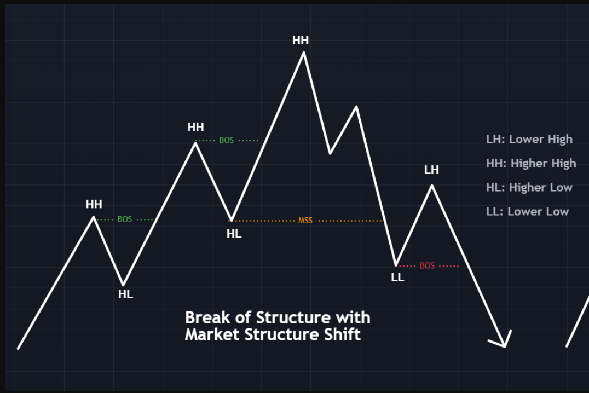

# Understanding Market Structure Shift in Trading

### Introduction

The **Market Structure Shift (MSS)** is one of the most significant early indicators of a potential trend change in the financial markets. Recognizing and understanding this shift is a critical skill for traders utilizing **Smart Money Concepts (SMC)**.

In this guide, we will:

- Explore the types of market trends.
- Understand what constitutes a market structure shift.
- Learn how to trade market structure shifts effectively.

---

### Market Trends Overview

The market operates in three primary trends:

1. **Bullish Trend**: Prices are consistently making higher highs and higher lows.
2. **Bearish Trend**: Prices are consistently making lower lows and lower highs.
3. **Sideways Trend**: Prices oscillate within a range without a clear direction.

Understanding these trends is foundational for identifying a market structure shift.

---

### What is a Market Structure Shift (MSS)?

A **Market Structure Shift** occurs when the price breaks a significant swing high or swing low, indicating a potential reversal in the existing trend. This can happen in both bullish and bearish trends.
   

#### Bearish Structure Shift

- **Condition**: Occurs when the market is in an **uptrend**, and the price breaks below the **previous swing low**.
- **Enhanced Setup**: If the liquidity from the previous high is also swept before breaking the swing low, it strengthens the setup.

#### Bullish Structure Shift

- **Condition**: Occurs when the market is in a **downtrend**, and the price breaks above the **previous swing high**.
- **Enhanced Setup**: If the liquidity from the previous low is swept before breaking the swing high, the probability of reversal increases.

---

### Key Components of MSS

1. **Liquidity Sweep**:

   - Before a structure shift, the market often sweeps liquidity from critical levels such as swing highs or lows.
   - This process allows big players (institutions) to accumulate or distribute positions.

2. **Break of Structure (BOS)**:

   - A confirmed shift in the trend requires the price to convincingly break above or below a critical swing level.

   

3. **Lower Timeframe Confirmation**:

   - Once a market structure shift is identified, traders often look for lower timeframe confirmations such as:
     - **Order Blocks**
     - **Fair Value Gaps**
     - Other Points of Interest (POI)

---

### Trading Market Structure Shifts

#### Steps to Trade a Bullish Market Structure Shift:

1. **Identify the Downtrend**:
   - Look for consistent lower highs and lower lows.

2. **Spot the Swing High**:
   - Mark the previous significant swing high.

3. **Wait for a Break**:
   - Wait for the price to break above the swing high, confirming a bullish structure shift.

4. **Look for POI**:
   - On a lower timeframe, identify areas of interest like order blocks or fair value gaps to enter trades.

#### Steps to Trade a Bearish Market Structure Shift:

1. **Identify the Uptrend**:
   - Look for consistent higher highs and higher lows.

2. **Spot the Swing Low**:
   - Mark the previous significant swing low.

3. **Wait for a Break**:
   - Wait for the price to break below the swing low, confirming a bearish structure shift.

4. **Look for POI**:
   - On a lower timeframe, identify potential entry zones such as order blocks or liquidity gaps.
---

### Practical Example

#### Bullish MSS Example:

1. The market is in a downtrend with lower highs and lower lows.
2. The price sweeps liquidity below the previous swing low.
3. The price then breaks above the previous swing high, signaling a bullish market structure shift.
4. Traders look for entries near an order block or fair value gap on a lower timeframe.

#### Bearish MSS Example:

1. The market is in an uptrend with higher highs and higher lows.
2. The price sweeps liquidity above the previous swing high.
3. The price then breaks below the previous swing low, signaling a bearish market structure shift.
4. Traders look for entries near a point of interest on a lower timeframe.

---

### Tips for Successful MSS Trading

1. **Wait for Confirmation**:
   - Ensure the break of structure is clear and not just a wick through the level.

2. **Combine with Liquidity Concepts**:
   - MSS setups are more reliable when combined with liquidity sweeps.

3. **Use Multiple Timeframes**:
   - Look for structure shifts on higher timeframes and refine entries on lower timeframes.

4. **Risk Management**:
   - Always use stop-loss orders below/above the liquidity sweep to manage risk effectively.

---

### Final Thoughts

The **Market Structure Shift** is a powerful concept within **Smart Money Concepts**. It provides traders with early indications of trend reversals and helps identify high-probability trading opportunities.

By combining MSS with liquidity sweeps and lower timeframe confirmations, traders can align their strategies with institutional movements and improve their overall trading edge.

Stay patient, practice on historical data, and refine your approach to become proficient in spotting and trading market structure shifts.

**Jai Hind!**

