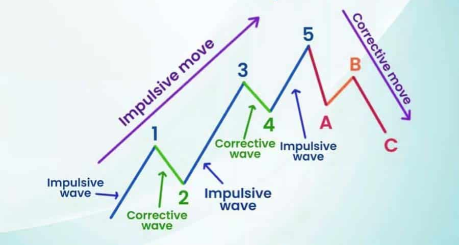

## Types of Waves in SMC 

1. IMPULSIVE
2. CORRECTIVE

Welcome to part 5 of learning SMC Here, we establish the foundational elements of market movements, focusing on the dynamics of **impulsive and corrective waves**. These concepts are not only central to understanding the complex interplay of market forces but are also crucial for delving deeper into more advanced trading strategies later in the book.

This chapter sets the stage for a nuanced appreciation of how markets behave in both uptrends and downtrends, providing you with the essential tools to navigate the trading landscape more effectively. As we proceed, keep in mind that this introduction, though concise, is the cornerstone upon which your understanding of Smart Money Concepts will be built.

This is part (4) of Smart Money Concepts Series:

---

## Impulsive and Corrective Waves

You are probably already familiar with **market structure**. During an **uptrend**, the market creates alternating up and down waves, in which strong **up waves** are followed by light **down waves**, then again strong up waves, and so forth. Conversely, during a **downtrend**, we observe strong **down waves** followed by light **up waves**, then continuing with strong down waves.

We refer to the strong waves as **impulsive waves**, while the lighter waves that go against the main trend are called **corrective waves**, or pullback/retracement waves.

However, regarding the **SMC methodology**, we need to identify impulsive and corrective waves with more precision, and the process is a bit more complex.

---

### Corrective Waves

First, let's discuss the conditions for the formation of a valid corrective wave that many traders often forget:

> **In an uptrend**, the price must break through the lowest point of the previous candle.
> **In a downtrend**, it must break through the highest point of the previous candle.

Now, let's delve into the details of some **pullback scenarios** below.

#### Valid Corrective Waves in an Uptrend

Let’s examine an uptrend. We have two charts in place. On the left side of the illustration, we observe a strong price increase, followed by a slight decrease. This decrease is known as a **valid corrective wave**. Let’s analyze this in detail using three candles numbered 1, 2, and 3:

1. **Candle 1** demonstrates a strong increase.
2. **Candle 2** decreases and breaks below the lowest point of Candle 1, which confirms the formation of a correction wave.
3. **Candle 3** continues to decrease, reinforcing that this is indeed a valid correction wave.

In summary, in an uptrend, a valid corrective wave is identified when the second candle breaks below the lowest point of the first candle. If the second candle does not break below the lowest point but the third candle does, it is still considered a **valid corrective wave**.

In **Smart Money Concepts (SMC)**, this is referred to as a **"liquidity sweep"** — the process of breaking through highs or lows to capture liquidity. This concept is crucial as it helps identify significant points on the chart for trading.

#### Invalid Corrective Waves in an Uptrend

Consider the top-right scenario in the illustration:

- **Candle 9** is the highest candle.
- However, **Candles 10 and 11** do not break below the lowest point of Candle 9, so they are **not considered a valid corrective wave**, even though they may appear similar visually.

Similarly, candles 12 and 13 do not break the high or low of the preceding candle. Hence, they are also **not considered valid corrective waves**.

#### Corrective Waves in a Downtrend

When discussing corrective waves in an uptrend, we must also consider the corrective waves in a **downtrend**. Although the fundamental principle is similar, the **opposite direction of the trend** requires clarification, especially for beginners to avoid confusion while learning.

To identify a valid corrective wave in a downtrend:

> It is confirmed when **subsequent candles break the highest or lowest points of the previous candles**. These breakpoints are crucial for confirming the presence of a valid correction wave.

---

### Impulsive Waves

**Impulsive waves** play a pivotal role, showcasing the market’s primary direction during an uptrend or downtrend. Unlike corrective waves, which often require careful scrutiny to distinguish subtle nuances in price behavior, impulsive waves are comparatively straightforward to identify.

#### Impulsive Waves in an Uptrend

In an uptrend, the impulsive wave represents the primary **upward movement** of the market. This is the wave that shows **strong bullish momentum** and typically consists of several consecutive bullish candles that break above the previous highs, signaling the strength of the market’s upward direction.

To identify a valid impulsive wave in an uptrend, observe these conditions:

1. **Strong Movement in Price**: The price should rise significantly in a short period. This movement is characterized by large-bodied candles with little to no wick, indicating that buyers are in control.
2. **Break of the Previous High**: The price must break above the most recent high, typically formed during a corrective wave (the pullback or retracement).
3. **Consistent Bullish Momentum**: The impulsive wave should be marked by a series of candles that consistently push higher, indicating that demand is greater than supply.

#### Impulsive Waves in a Downtrend

In a **downtrend**, the impulsive wave works in the opposite direction, representing the dominant downward movement of the market. Impulsive waves in a downtrend are typically marked by several consecutive bearish candles that break below previous lows, signifying sellers are in control.

To identify a valid impulsive wave in a downtrend, observe these conditions:

1. **Strong Movement Downward**: The price should drop significantly in a short time frame, showing powerful bearish momentum.
2. **Break of the Previous Low**: The price must break below the most recent low, typically formed during the previous corrective wave.
3. **Sustained Bearish Momentum**: A valid impulsive wave is marked by several bearish candles, consistently pushing lower.

---

## Conclusion

In this chapter, we have explored the fundamental concepts of **impulse waves** and **corrective waves** within the **Smart Money Concepts (SMC)** framework. Understanding the differentiation between impulsive movements and corrective phases is crucial for developing a robust trading strategy.

We discussed:

- How to identify valid corrective waves in both uptrends and downtrends.
- The importance of price levels breaking through prior highs or lows to confirm these waves.
- The identification of impulsive waves in the markets and their crucial roles in trading with SMC.

Recognizing these patterns will enable you to better analyze market behavior and make more informed trading decisions. As we move forward, applying these principles will become second nature with practice.

The key takeaway from this chapter is the necessity of meticulous observation and validation of market waves to accurately interpret market structure. In the following chapters, we will build upon this knowledge to delve deeper into market structure analysis and its practical applications in trading.

