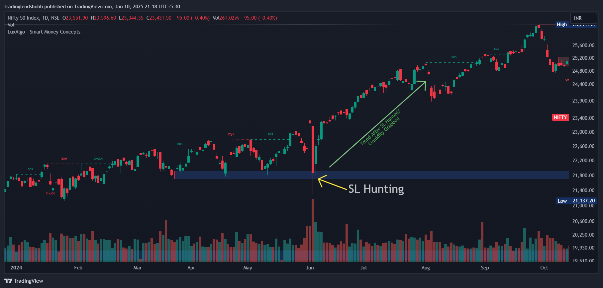
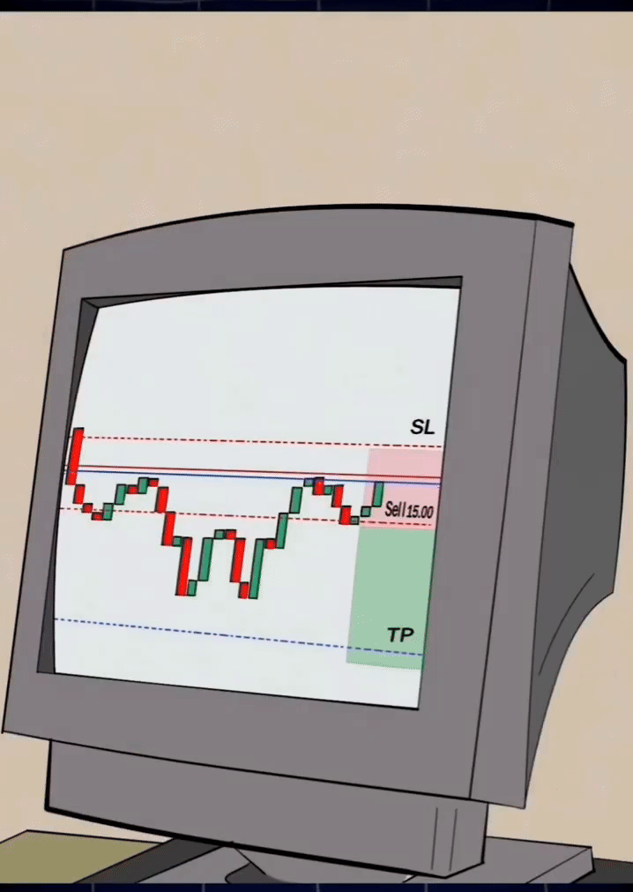

# **Smart Money Concepts - Day 1**

Everyone is talking about Smart Money Concepts but what it is actually?

|  |  |

Welcome to **Day 1 of Smart Money Concepts**, where we’ll explore how the market operates, from stop-loss hunting to understanding liquidity. Let's dive into the **basics of SMC** and build a foundation for advanced trading concepts.

## **Key Question**

**Why does the market hit your stop-loss and then move straight to your target?**

### The Answer is Smart Money!

This behavior is not random—it’s a deliberate move by institutional traders to manipulate retail traders.

---

## **The Concept of Smart Money**

Smart Money refers to **big players** in the market, like institutions, hedge funds, and banks. They control the market direction by trapping retail traders and grabbing liquidity.

Here’s how it works:

 |

### **1. The Trapping Mechanism**

 
| |

- If the market intends to move **up**, it first drops to:

- **Hunt stop-losses** placed by retail traders, Stoplosses act as **liquidity** (i.e., orders stacked below support levels. If big players wants to buy huge volume, they need to buy from someone, so they will buy from retail traders who have placed their stoplosses below support levels.

  

- Once liquidity is collected, the market moves sharply in its intended direction, and this is how Big players buy at Discount zones and Sell and Premium zones.
  

### **2. Liquidity, Stop-Loss Hunting & Manipulation**

- **Liquidity** is where a large number of orders (stop-losses, pending orders) are placed.
- The market moves to these levels to **consume liquidity** and then continues in the planned direction.
  

### **Example Scenario:**

- You buy near a support zone.
- The market breaks the support zone, hitting your stop-loss.
- It then reverses and moves up to your original target.
- **What happened?** Your stop-loss was hunted by Smart Money to grab liquidity!

---

## **Key Market Zones**

The market operates on the principle of **Discount Zones** and **Premium Zones**:

- **Discount Zone**: Where Smart Money buys.
- **Premium Zone**: Where Smart Money sells.

This forms the basis of **liquidity grabbing, stop-loss hunting, and market manipulation**.

---

## **Why Does This Happen?**
- Answer is Liquidity
- The market seeks areas of **high liquidity** (where many orders are placed).
- These areas act as magnets for price movement.
- Once liquidity is grabbed, the market moves in its **true direction**.

---

## **Day 1 Takeaways**

- Stop-loss hunting is not random—it’s Smart Money grabbing liquidity.
- Liquidity zones are key to understanding market movements.
- The market moves:
  - **Down to grab liquidity** (if it wants to go up).
  - **Up to grab liquidity** (if it wants to go down).
- Always think like an **institutional trader**:
  - Identify **liquidity zones**.
  - Avoid obvious stop-loss placements.

---

## **Next Steps**

- On **Day 2**, we’ll learn:
  - What is Liquidity?
  - How to identify Liquidity Zones.
  - How to trade like institutional traders.

Stay tuned, and get ready to level up your trading game!

---

### **Bonus Tip:**

- Think of Smart Money like a chess game—they plan their moves several steps ahead. To win, you need to observe, adapt, and act with precision!

---
---
