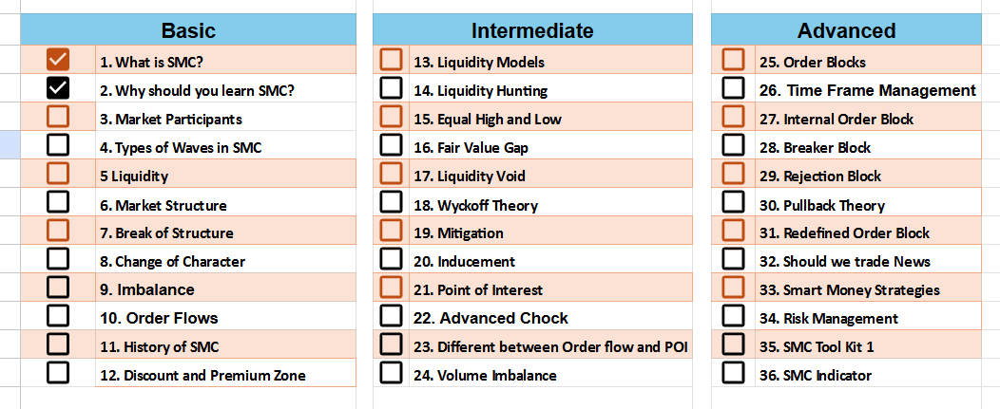
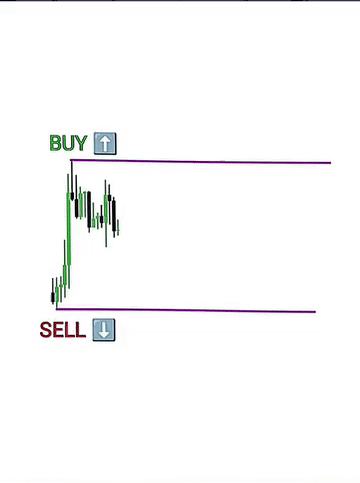
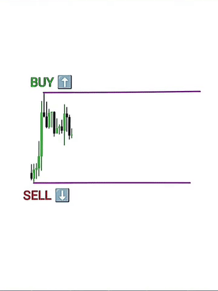

# **Smart Money Concepts - Day 2**

Welcome to Day 2 of SMC.

## **Why Should You Learn SMC?**

Smart Money Concepts (SMC) is not just another strategy—it's a mindset that helps traders think and act like institutional players. While SMC alone may not guarantee profitability, it simplifies understanding the market's underlying mechanisms and works with remarkable accuracy.

First thing to understand is that:

### **Key Lesson**

> **"If you don’t know where the liquidity is, then you are the liquidity."**

### **Trapping Mechanism:**

## 

The market is designed to trap small, retail traders and profit from their mistakes. Understanding this principle is the foundation of Smart Money Concepts.
Tab tak ap chote player hi banke reh jaoge..
jo har bar big players yani smart money ke trap ma fasega...

---

---

## **The Problem with Retail Thinking**

Retail traders often:

1. **Buy when the market is going up**.
2. **Sell when the market is going down**.

This reactive behavior leads them to fall into traps set by the market:

- They place their orders at **obvious levels**, such as resistance or support, making their stop-losses easy targets for institutional players.
- **Big players**, also known as **Smart Money**, use these liquidity pockets to fill their own orders, manipulating price in the process.

---

## **The Role of Smart Money**

Smart Money refers to **institutional traders**, such as banks and hedge funds, that control large amounts of capital. Their goals are:

- To **manipulate price movements** by hunting liquidity.
- To trap retail traders and profit from their predictable behavior.

---

## **Why Learn SMC?**

By learning SMC, you can:

1. **Identify liquidity traps**:

   - Recognize where retail traders are likely to place their orders.
   - Avoid becoming a victim of stop-loss hunting.

2. **Think like institutional traders**:

   - Instead of reacting to price movement, anticipate the actions of Smart Money.
   - Trade alongside the big players by identifying their footprints in the market.

3. **Align with market logic**:
   - Understand that every move in the market is intentional.
   - Develop strategies that account for market manipulation.

---

## **Core SMC Philosophy**

- The market is a **game of traps**.
- To win, you must **think ahead**:
  - Where is the liquidity?
  - Where will Smart Money hunt next?
- Learning to identify **institutional behavior** helps you avoid retail mistakes and trade with confidence.

---

### **Day 2 Takeaways**

- **Smart Money Concepts** teach you how to trade like the big players.
- Avoid retail traps by:
  1. Understanding liquidity zones.
  2. Thinking ahead of price action.
  3. Acting strategically rather than reacting emotionally.
- Remember: **If you don’t know where the liquidity is, then you are the liquidity.**

---

## **What’s Next?**

In **Day 3**, we’ll dive deeper into:

- The **types of liquidity**.
- How to identify liquidity zones on a chart.
- Practical steps to start trading with Smart Money Concepts.

Stay tuned for the next session and take your trading knowledge to the next level!
